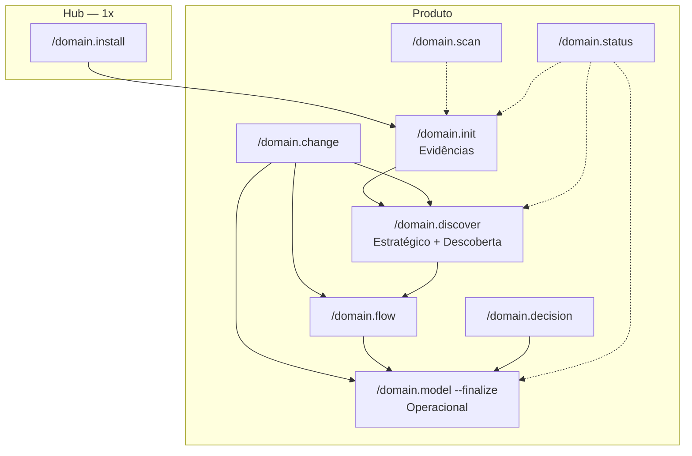

# Domain-Kit — Guia de comandos

Referência rápida: **o que cada comando entrega**, quando usar, e fluxos para produtos novos vs antigos.

Idioma dos artefatos: **pt-BR**. Contrato: [references/plan-mode.md](references/plan-mode.md) · Fases: [SKILL.md](SKILL.md).

---

## Tabela — comando → entrega → o que NÃO entrega

| Comando | Entrega real (peso) | Fase | NÃO entrega |
| --- | --- | --- | --- |
| `/domain.install` | Comandos `domain-*`, `.domain/skills/`, wrappers, scripts, MCP checklist | — | Artefato de produto |
| `/domain.init {p}` | Índices + **primeiro scan** + **síntese** | **Evidências** | Lacunas (0b), BCs, ES, fluxos, design de solução |
| `/domain.init {p} --adopt` | Índices faltantes + inventário + gaps | — | Não recria conteúdo existente |
| `/domain.scan {p}` | Delta no manifest + refresh síntese + CHANGELOG | Evidências (re-sync) | Lacunas (0b), DDD |
| `/domain.discover {p}` | Lacunas (0b) + DDD **por estágio** (`--stage`) | **Estratégico** / **Descoberta** | Design de solução, fluxos to-be, integração técnica |
| `/domain.flow {NN}` | 1 fluxo **operacional de negócio** | **Operacional** | Serviços/filas, outros fluxos |
| `/domain.decision` | 1 linha D-n no registry | Operacional | Texto longo duplicado |
| `/domain.model {p}` | NFRs de produto (draft) | Operacional | Finalize |
| `/domain.model {p} --finalize` | NFRs + validação Operacional | **Operacional** | C4, ADR, design tático, modelo de dados físico |
| `/domain.change` | Sessão P-n / E-n + `activeChange` + handoff | Transversal | Artefatos DDD diretos |
| `/domain.status {p}` | Diagnóstico de fases + próximo comando | — | Conteúdo novo |
| ~~`/domain.capability`~~ | **Fora do escopo do domain-kit** | — | — |

---

## Pipeline recomendado — produto novo

```text
/domain.install                         # 1× por hub
/domain.init meu-produto                # Evidências
/domain.discover                        # lacunas + auto: próximo estágio
/domain.discover --stage strategic      # ou contexts | stories | event-storming
/domain.flow 01 … NN                    # 1 fluxo = 1 sessão (04-operacional/fluxos/)
/domain.model --finalize                # Operacional
```

Após **Operacional**, a próxima etapa técnica fica **fora do escopo do domain-kit**.

Re-sync: `/domain.scan`. Evolução: `/domain.change`.

---

## Árvore de decisão — qual comando usar?

```text
Primeira vez no hub?
  └─ SIM → /domain.install

Produto novo no hub?
  └─ SIM → /domain.init {p} → /domain.discover

Produto JÁ existe no hub mas sem domain-kit?
  └─ SIM → /domain.init {p} --adopt → /domain.status

Sistema LEGADO em produção?
  └─ SIM → /domain.init {p} → /domain.discover --mode as-is-first

Algo mudou depois do onboarding (problema ou evolução)?
  └─ SIM → /domain.change → handoff sugerido

Nova jornada em produto com Operacional PASS?
  └─ SIM → /domain.change --kind evolution → /domain.flow {NN}

Só repo/doc MUDOU?
  └─ SIM → /domain.scan  (ou /domain.change se quiser registrar P-n/E-n)

Não sabe onde está?
  └─ /domain.status {p}
```

Design tático / integração técnica / implementação → **fora do escopo do domain-kit**.

---

## Cenários — produtos antigos

Narrativa ponta a ponta (produto novo + evolução + problema): [references/exemplo-ciclo-completo.md](references/exemplo-ciclo-completo.md).

### A — Produto novo (greenfield)

Ver pipeline acima e o exemplo completo. Plan mode em cada artefato.

### B — Sistema legado em produção

```text
/domain.init legado --initiative X
/domain.discover legado --mode as-is-first
  → regras atuais (fluxogramas) + UL + BCs mínimos
/domain.flow 01 …
/domain.model --finalize
```

Após **Operacional**, a próxima etapa técnica (design de solução, modelo de dados) fica **fora do escopo do domain-kit**.

### C — Produto já no hub, nunca passou pelo domain-kit

```text
/domain.init produto-existente --adopt
/domain.status                     → gaps por fase
/domain.discover --mode minimal    → preenche Estratégico
/domain.flow …
/domain.model --finalize
```

### D — Evolução pós-Operacional

| Necessidade | Comando |
| --- | --- |
| Abrir sessão | `/domain.change` |
| Doc/repo mudou | `/domain.scan` |
| Nova jornada | `/domain.flow {NN}` |
| Nova regra / lacuna | `/domain.change` → discover/decision |
| Revalidar fase | `/domain.model --finalize` |
| Implementação / design de solução | Fora do escopo do domain-kit |

**Não rerodar** discover completo salvo redefinição de domínio.

---

## Modos de `/domain.discover`

| Modo | Quando |
| --- | --- |
| `full` (default) | Produto novo — sequência completa |
| `minimal` | CRUD simples, 1 BC — prioriza estratégico + contexts |
| `as-is-first` | Legado — prioriza regras atuais |
| `incremental` | Delta de escopo / BC |

---

## Fases — o que significam na prática

| Fase | Após | Critério resumido |
| --- | --- | --- |
| **Evidências** | `/domain.init` | sources.yml + scan (manifest ou skip) |
| **Estratégico** | discover contexts | design estratégico + desafio + BCs + UL |
| **Descoberta** | stories / ES | event-storming **ou** domain-storytelling |
| **Operacional** | flow + model --finalize | ≥1 fluxo ready + NFR + registry |

Validação: `.domain/scripts/validate_gate.py --phase operacional --product {p} --suggest`

Definição máquina: [references/gates.yml](references/gates.yml).

---

## Confusões comuns

| Confusão | Realidade |
| --- | --- |
| `init` = só índices | **Não** — inclui primeiro scan + síntese (Evidências) |
| `install` = init | **Não** — install = hub; init = produto |
| `scan` = discover | **Não** — scan = fontes; discover = negócio |
| Preciso de capability para fechar | **Não** — capability está fora do escopo; Operacional = fluxos negócio + NFR |
| Onde gravar fluxos? | `01-product/04-operacional/fluxos/` — ver [hub-paths.md](references/hub-paths.md) |
| `model` faz integração ACL | **Não** — integração técnica fica fora do escopo do domain-kit |

---

## Diagrama — camadas de comando



---

## Mais leitura

- [GUIDE.md](GUIDE.md) · [ONBOARDING.md](ONBOARDING.md)
- [references/discovery-workflow.md](references/discovery-workflow.md)
- [references/pipeline.md](references/pipeline.md)
- [wrappers/README.md](wrappers/README.md) · [skills/README.md](skills/README.md)
