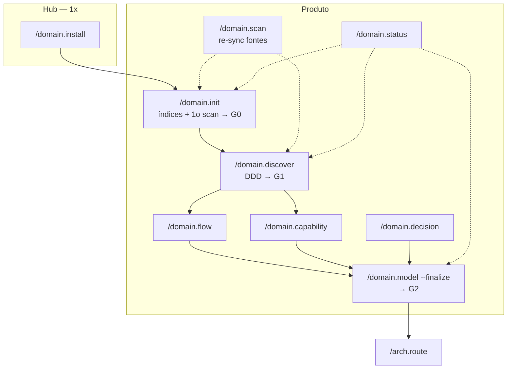

# Domain-Kit — Guia de comandos

Referência rápida: **o que cada comando entrega em peso real**, quando usar, e fluxos para produtos novos vs antigos.

Idioma dos artefatos: **pt-BR**. Contrato de gravação: [references/plan-mode.md](references/plan-mode.md).

---

## Tabela — comando → entrega → o que NÃO entrega

| Comando | Entrega real (peso) | Gate | NÃO entrega |
| --- | --- | --- | --- |
| `/domain.install` | Skills `domain-*`, scripts `.domain/`, wrappers, checklist MCPs | — | Nenhum artefato de produto |
| `/domain.init {p}` | Índices + **primeiro scan** + **síntese de evidências** (sources, manifest, curadoria, sintese) | **G0** | Lacunas (0b), BCs, ES, fluxos, tático |
| `/domain.init {p} --adopt` | Índices faltantes + inventário + gaps + status atual | — | Não recria conteúdo existente |
| `/domain.scan {p}` | Delta no manifest + refresh síntese + **entrada CHANGELOG** | G0 (re-sync) | Lacunas (0b), DDD, modelagem |
| `/domain.discover {p}` | Lacunas (0b) + DDD **por estágio** (`--stage`) | **G1** | Síntese (vem do init), tático, fluxos to-be, integração |
| `/domain.flow {NN}` | 1 jornada to-be numerada (vira 1 Tech Story) | parte de G2 | Outros fluxos, BCs |
| `/domain.capability {bc}` | Agregados + invariantes de 1 BC | parte de G2 | Outros BCs, integração |
| `/domain.decision` | 1 linha D-n no registry com evidência | parte de G2 | Texto longo duplicado |
| `/domain.model {p}` | Integração entre BCs (+ sweep parcial) | — | Finalização G2 |
| `/domain.model {p} --finalize` | Requisitos RF/RNF + validação G2 completa | **G2** | C4, ADR, database-model |
| `/domain.status {p}` | Diagnóstico gates + gaps + **próximo comando** | — | Conteúdo novo |

**Alias deprecado:** `/workkit.init` → use `/domain.install`.

---

## Pipeline recomendado — produto novo

```text
/domain.install                    # 1x por hub
/domain.init meu-produto           # índices + scan + síntese → G0
/domain.discover                   # lacunas (0b) + auto: próximo estágio DDD
/domain.discover --stage strategic # ou stories | event-storming | contexts
/domain.flow 01 … NN               # 1 fluxo = 1 sessão
/domain.capability {bc}            # tático por BC
/domain.model --finalize           # G2 → /arch.route
```

Re-sync de fontes (depois): `/domain.scan`.

---

## Árvore de decisão — qual comando usar?

```text
Primeira vez no hub?
  └─ SIM → /domain.install

Produto novo no hub?
  └─ SIM → /domain.init {p} → /domain.discover

Produto JÁ existe no hub (docs/pastas) mas sem domain-kit?
  └─ SIM → /domain.init {p} --adopt → /domain.status

Sistema LEGADO em produção (código existe, docs pobres)?
  └─ SIM → /domain.init {p} → /domain.discover --mode as-is-first

Nova CAPABILITY em produto que já passou G2?
  └─ SIM → /domain.discover --mode incremental --bc {bc}
           → /domain.capability {bc} → /domain.flow {NN}
           → /domain.model --finalize --mode incremental --bc {bc}

Só repo/doc MUDOU?
  └─ SIM → /domain.scan

Não sabe onde está?
  └─ /domain.status {p}
```

---

## Cenários — produtos antigos

### A — Produto novo (greenfield)

Ver pipeline acima. Cada artefato passa por plan mode (`.draft/` → OK → hub).

### B — Sistema legado em produção

```text
/domain.init legado --initiative X
/domain.discover legado --mode as-is-first
  → fluxogramas-decisao/ (regras atuais)
  → UL + BCs mínimos derivados do código
/domain.capability {bc}
/domain.flow 01 …
/domain.model --finalize
/arch.route                        → database-model as-is no arch-kit
```

**Fronteira:** domain-kit = regras de negócio (as-is + to-be). arch-kit = schema físico legado.

### C — Produto já no hub, nunca passou pelo domain-kit

```text
/domain.init produto-existente --adopt
/domain.status                     → lista gaps (G0–G2)
/domain.discover --mode minimal     → preenche gaps de discover
/domain.flow / domain.capability   → completa o que falta
/domain.model --finalize           → G2 quando gaps zerados
```

### D — Produto pós-G2 (evolução)

| Necessidade | Comando |
| --- | --- |
| Doc/repo mudou | `/domain.scan` |
| Nova jornada | `/domain.flow {NN}` |
| Nova capability | `/domain.discover --mode incremental --bc {bc}` + `/domain.capability {bc}` |
| Nova regra | `/domain.decision` |
| Revalidar handoff | `/domain.model --finalize --mode incremental --bc {bc}` |

**Não rerodar** discover/model completos salvo redefinição de domínio.

---

## Modos de `/domain.discover`

| Modo | Quando |
| --- | --- |
| `full` (default) | Produto novo — sequência completa |
| `minimal` | CRUD simples, 1 BC — pula stories/ES |
| `as-is-first` | Legado — prioriza fluxogramas-decisao |
| `incremental` | Nova capability — escopo `{bc}` apenas |

---

## Gates — o que significam na prática

| Gate | Após comando | Critério resumido |
| --- | --- | --- |
| **G0** | `/domain.init` | sources.yml + scan-manifest (ou skip documentado) |
| **G1** | `/domain.discover` | Estratégico + BCs + ES ou ≥2 stories |
| **G2** | `/domain.model --finalize` | Integração + tático + ≥1 fluxo + D-n + RF |

Validação: `.domain/scripts/validate_gate.py --product {p} --suggest`

---

## Confusões comuns

| Confusão | Realidade |
| --- | --- |
| `init` = scan | **Correto agora** — `/domain.init` inclui primeiro scan (G0) |
| `install` = init | **Não** — `install` = hub (1x); `init` = produto |
| `scan` = discover | **Não** — `scan` = fontes; `discover` = negócio/BCs |
| `discover` só para produto novo | **Não** — use modos `as-is-first`, `incremental`, `minimal` |
| `model` refaz tudo | **Não** — `--mode incremental` valida só `{bc}` novo |

---

## Diagrama — camadas de comando



---

## Mais leitura

- [GUIDE.md](GUIDE.md) — guia do usuário
- [ONBOARDING.md](ONBOARDING.md) — setup MCPs e primeiro produto
- [references/discovery-workflow.md](references/discovery-workflow.md) — estágios DDD: para que servem, como identificá-los e mapeamento para comandos
- [references/commands.md](references/commands.md) — spec completa
- [references/pipeline.md](references/pipeline.md) — estágios 1–7
- [references/examples-oficina.md](references/examples-oficina.md) — walkthrough real
