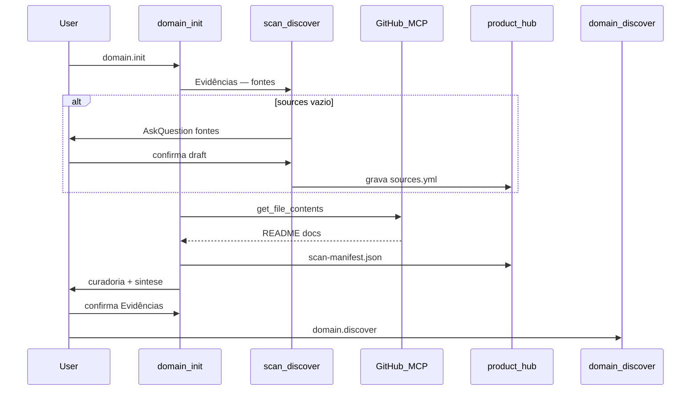

# Domain-Kit — Como funciona por dentro

Documentação para mantenedores e arquitetos.

---

## Escopo do pipeline

```text
Evidências → Estratégico → Descoberta → Operacional
   ↑ você está aqui (domain-kit)
```

O pipeline do domain-kit **termina em Operacional**. A próxima etapa técnica fica **fora do escopo do domain-kit**.

Critérios de fase: [references/gates.yml](references/gates.yml). Handoffs internos: [references/handoffs.md](references/handoffs.md).

---

## Camadas de comandos

| Camada | Comandos | Papel |
| --- | --- | --- |
| **Hub** | install | Kit no hub (1×) |
| **Meta** | init, scan, status, change | Bootstrap, re-sync, visibilidade, sessões evolutivas |
| **Macro** | discover, model | Estratégico/Descoberta; fechar Operacional |
| **Micro** | flow, decision | Uma unidade por sessão |

~~capability~~ — **fora do escopo do domain-kit**. Macro = conveniente; **micro** recomendado com N fluxos.

---

## Fonte de verdade

| Arquivo | Conteúdo |
| --- | --- |
| `product-README.md` | Cartão PM — visão, benefícios, status por fase |
| `domain-status.json` | Fases, `activeChange`, próximo comando |
| `flows-registry.yml` | Catálogo fluxo-NN, deps, status |
| `scan-manifest.json` | Findings de fontes externas |
| `CHANGELOG.md` | Histórico de scans e mudanças |
| `05-decisoes/produto.md` | Decisões D-n |
| Artefatos MD | Conteúdo; dashboard só lê |

Dashboard é **read-only**. PlantUML: porta **8765** — [references/plantuml-dashboard.md](references/plantuml-dashboard.md).

---

## Fases

| Fase | Após | Critério resumido |
| --- | --- | --- |
| **Evidências** | init | sources + scan (manifest ou skip) |
| **Estratégico** | discover contexts | design + desafio + BCs + UL |
| **Descoberta** | stories / ES | event-storming **ou** storytelling |
| **Operacional** | flow + model --finalize | ≥1 fluxo ready + NFR + registry |

**Não** exige integração técnica nem design tático para fechar Operacional.

Definição: [references/gates.yml](references/gates.yml) · `validate_gate.py --phase …`

---

## Ingestão de fontes externas

Plan + Execute + curadoria na **fase Evidências** (`/domain.init`). Re-sync: `/domain.scan`.



Roteiros: [templates/clarify/scan-discover.md](templates/clarify/scan-discover.md) · [wrappers/scan-gitlab.md](wrappers/scan-gitlab.md).

---

## Plan mode

Todo conteúdo: **rascunho** (`.draft/` + chat) → **OK** → hub. [references/plan-mode.md](references/plan-mode.md).

`/domain.clarify` **deprecado**.

## Lazy init (pastas sob demanda)

| Pasta | Criado por |
| --- | --- |
| `01-product/00-scan/` | `/domain.init` ou `/domain.scan` |
| `01-product/01-vision/`, `02-domain/`, `03-discovery/` | `/domain.discover` |
| `01-product/04-operacional/fluxos/` | `/domain.flow` |
| `01-product/04-operacional/` | `/domain.model` |

Pastas de design de solução / integração técnica ficam **fora do escopo do domain-kit**.

`/domain.init` cria índices + primeiro scan. **`--adopt`** para produtos já no hub.

---

## Wrappers vs skills bundled

Know-how: `domain-kit/skills/{nome}/SKILL.md` → após install `.domain/skills/`.

Wrappers: paths/fases — **autoridade de path**. Skill = know-how; em conflito de path, o wrapper vence ([hub-paths.md](references/hub-paths.md)).

---

## Multi-fluxo

`flows-registry.yml`:

- `fluxo-NN` com deps
- Status: `draft` → `clarifying` → `ready`
- Path canônico: `01-product/04-operacional/fluxos/{NN}-{slug}.md`

`/domain.flow NN` valida deps via `flow_deps.py`.

---

## Dashboard

`generate_domain_dashboard.py` lê status/registry, valida fases, gera HTML.

---

## Estrutura do pacote

```text
domain-kit/
├── GUIDE.md ONBOARDING.md HOW-IT-WORKS.md INVENTORY.md
├── SKILL.md
├── skills/             ← know-how DDD bundled
├── wrappers/           ← contratos de path/fase
├── templates/
├── scripts/
└── references/
```

```text
hub/                      ← raiz de products/ (ex.: architecture-hub)
├── .domain/              ← config, scripts, clarify/, skills/, wrappers/
└── .cursor/skills/domain-*/
```

---

## Extensão

1. Pasta em `skills/{nova-skill}/`
2. `wrappers/nova-skill.md`
3. Comando em `templates/commands/`
4. Atualizar `skills/README.md` e docs de fase
