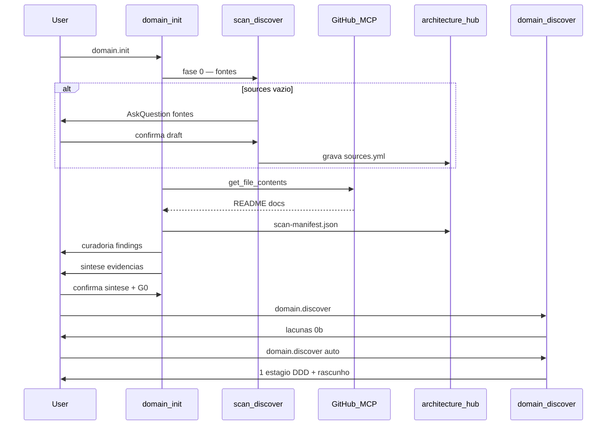

# Domain-Kit — Como funciona por dentro

Documentação para mantenedores e arquitetos.

---

## Posição no pipeline

```text
domain-kit  →  arch-kit  →  delivery-kit  →  spec-kit  →  código
   ↑ você está aqui
```

Handoff domain → arch: **H2** quando Gate **G2** passa ([../references/handoffs.md](../references/handoffs.md)).

---

## Camadas de comandos

| Camada | Comandos | Papel |
| --- | --- | --- |
| **Hub** | install | Framework no hub (1x) |
| **Meta** | init, scan, status | Bootstrap produto, re-sync fontes, visibilidade |
| **Macro** | discover, model | Orquestram várias skills em batch |
| **Micro** | flow, capability, decision | Uma unidade de trabalho por sessão |

Macro = conveniente para replay; **micro = recomendado** em produtos com N fluxos.

---

## Fonte de verdade

| Arquivo | Conteúdo |
| --- | --- |
| `domain-status.json` | Fase atual, gates, scan status |
| `flows-registry.yml` | Catálogo fluxo-NN, deps, status |
| `scan-manifest.json` | Findings de fontes externas (citados) |
| `CHANGELOG.md` | Histórico de scans e mudanças significativas |
| `03-registry/produto.md` | Decisões D-n |
| Artefatos MD | Conteúdo; dashboard só lê |

O dashboard HTML é **read-only** — nunca inventa progresso.

Diagramas PlantUML nos MD são renderizados na aba Preview via servidor local (**porta 8765**).
Ver [references/plantuml-dashboard.md](references/plantuml-dashboard.md).

---

## Gates

| Gate | Após | Critério resumido |
| --- | --- | --- |
| **G0** | init (scan + síntese) | Manifest ou skip documentado + `sintese-evidencias.md` recomendado |
| **G1** | discover | Estratégico + BCs + discovery |
| **G2** | model | Integração + tático + fluxos + D-n + RF |

Definição: [references/gates.yml](references/gates.yml) · validação: `validate_gate.py`

---

## Ingestão de fontes externas

Lógica **Plan + Execute + curadoria**. Roda na **fase 0 de `/domain.init`** (Gate G0). **`/domain.scan`** para re-sync.



Roteiro Plan: [templates/clarify/scan-discover.md](templates/clarify/scan-discover.md) · Curadoria: [templates/clarify/scan.md](templates/clarify/scan.md)

GitLab/Confluence: mesmo contrato de manifest; implementação via wrapper + fallback manual ([wrappers/scan-gitlab.md](wrappers/scan-gitlab.md)).

---

## Plan mode

Todo conteúdo: **rascunho** (`.draft/` + chat) → **OK** → hub. Ver [references/plan-mode.md](references/plan-mode.md).

`/domain.clarify` **deprecado** — não documentar como passo do pipeline.

## Lazy init (pastas sob demanda)

| Pasta | Criado por |
| --- | --- |
| `01-product/00-scan/` | `/domain.init` (G0) ou `/domain.scan` (re-sync) |
| `01-product/01-vision/`, `02-domain/`, `03-discovery/` | `/domain.discover` |
| `02-capabilities/{bc}/` | `/domain.capability`, `/domain.flow` |
| `04-platform/01-non-functional/` | `/domain.model` |

`/domain.init` cria índices + conduz primeiro scan. **`--adopt`** para produtos já no hub.

---

## Wrappers vs skills bundled

Know-how DDD vive **no próprio kit**: `domain-kit/skills/{nome}/SKILL.md`. Após install: `.domain/skills/`.

`domain-kit/wrappers/{skill}.md` define:

- Qual comando invoca
- Pré-condições (fases, paths)
- Outputs esperados no hub
- Link para a skill bundled

Comandos em `.cursor/skills/domain-*/SKILL.md` dizem: *siga o wrapper; leia `.domain/skills/{nome}/SKILL.md` para know-how completo*.

---

## Multi-fluxo

`flows-registry.yml` é o índice central:

- `fluxo-NN` com deps (`fluxo-02` depende de `fluxo-01`)
- Status: `draft` → `clarifying` → `ready`
- Link para MD em `02-capabilities/{bc}/fluxos/`

`/domain.flow NN` valida deps antes de começar.

Oficina: 7 fluxos → depois viram Tech Stories #11–#17 (delivery-kit).

---

## Dashboard

`generate_domain_dashboard.py`:

1. Lê `domain-status.json`, `flows-registry.yml`
2. Checa existência de paths canônicos
3. Opcionalmente roda `validate_gate.py`
4. Gera HTML com pipeline, grade de fluxos, tabs MD

Espelha filosofia do [spec-kit-dashboard](../../spec-kit-dashboard/).

---

## Estrutura do pacote

```text
domain-kit/
├── GUIDE.md ONBOARDING.md HOW-IT-WORKS.md INVENTORY.md
├── SKILL.md
├── skills/             ← know-how DDD bundled (repo autossuficiente)
├── wrappers/           ← contratos de path/fase → skills/
├── templates/          ← sources, registry, commands overlays
├── scripts/            ← install, dashboard, validate_gate
└── references/         ← pipeline, commands, gates, examples
```

Instalação copia para hub:

```text
architecture-hub/
├── .domain/            ← config, scripts, clarify/, skills/, wrappers/
└── .cursor/skills/domain-*/
```

---

## Extensão

Para nova skill DDD:

1. Adicionar pasta em `skills/{nova-skill}/` (SKILL.md + refs)
2. Criar `wrappers/nova-skill.md` apontando para ela
3. Referenciar no comando macro/micro adequado
4. Atualizar `references/commands.md` e `skills/README.md`

Para novo provedor de scan:

1. `wrappers/scan-{provedor}.md`
2. Estender schema `sources.yml`
3. Overlay `domain.scan`
