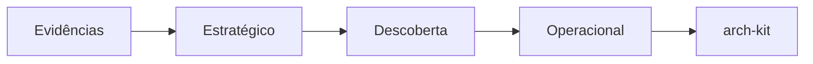

# Estágios do DDD Discovery — guia prático

Explica **cada estágio da descoberta**, para que serve, como saber onde você está e **qual comando** aciona.

Referências:

- Fases e critérios: [`gates.yml`](gates.yml) · [`pipeline.md`](pipeline.md)
- Comandos: [`../COMMAND-GUIDE.md`](../COMMAND-GUIDE.md) · [`../SKILL.md`](../SKILL.md)
- Skills bundled: [`../skills/README.md`](../skills/README.md)

O domain-kit cobre **Evidências → Estratégico → Descoberta → Operacional**. Design tático e integração técnica → **arch-kit** após Operacional PASS.

---

## Visão geral

| Ordem | Fase | Estágio discover | Comando |
| --- | --- | --- | --- |
| 0 | Evidências | scan + síntese | `/domain.init` · `/domain.scan` |
| 1 | Estratégico | `strategic` | `/domain.discover --stage strategic` |
| 2 | Estratégico | `contexts` | `/domain.discover --stage contexts` |
| 3 | Descoberta | `stories` | `/domain.discover --stage stories` |
| 4 | Descoberta | `event-storming` | `/domain.discover --stage event-storming` |
| 5 | — | cenários (opcional) | skill `event-storming-to-scenario-tables` |
| 6 | Operacional | fluxos negócio | `/domain.flow {NN}` |
| 7 | Operacional | NFR + finalize | `/domain.model --finalize` |
| 8 | Arch | tático / integração | `/arch.route` · `/arch.capability` |

Ordem sugerida em `full`: 0b lacunas → estratégico → contexts → stories → event-storming → fluxos → finalize.



---

## Fase Evidências

| | |
| --- | --- |
| **Pergunta** | O que sabemos, com fonte? |
| **Comando** | `/domain.init` (primeiro) · `/domain.scan` (re-sync) |
| **Artefatos** | `sources.yml`, `scan-manifest.json`, `sintese-evidencias.md` |
| **PASS** | `validate_gate.py --phase evidencias` |

Não entrega BCs, stories nem fluxos.

---

## Fase Estratégico

### Design estratégico (`--stage strategic`)

| | |
| --- | --- |
| **Pergunta** | Qual o domínio? O que é core / supporting / generic? |
| **Skill** | `skills/ddd-design-estrategico` |
| **Artefato** | `01-product/01-vision/01-design-estrategico.md` |

### Contextos (`--stage contexts`)

| | |
| --- | --- |
| **Pergunta** | Qual o desafio? Como falamos? Quais BCs? |
| **Skill** | `skills/ddd-linguagem-e-contextos` |
| **Artefatos** | `desafio-negocio.md`, `linguagem-ubiqua.md`, `bounded-contexts.md` |
| **PASS** | `validate_gate.py --phase estrategico` |

`bounded-contexts.md`: mapa em **linguagem de negócio**. Sem ACL/filas — detalhe em `arch/01-integration/`.

Após contexts promovido: refresh `product-README.md`.

---

## Fase Descoberta

### Domain stories (`--stage stories`)

| | |
| --- | --- |
| **Pergunta** | Quem faz o quê, com quais objetos, em que ordem? |
| **Skill** | `skills/domain-storytelling` |
| **Artefato** | `03-discovery/02-domain-storytelling/{NN}-{slug}.md` |
| **Regra** | 1+ história por sessão |

### Event storming (`--stage event-storming`)

| | |
| --- | --- |
| **Pergunta** | Quais eventos, comandos e políticas no tempo? |
| **Skill** | `skills/event-storming` |
| **Artefato** | `03-discovery/01-event-storming/` |
| **Regra** | 1 workshop por sessão |

**PASS Descoberta:** event-storming **ou** domain-storytelling presente (`validate_gate.py --phase descoberta`).

Modo `minimal`: Descoberta pode ser relaxada (ver `gates.yml`).

Alias legado **G1** = Estratégico + Descoberta.

---

## Fase Operacional

### Fluxos de negócio (`/domain.flow`)

| | |
| --- | --- |
| **Pergunta** | Quais cenários ponta a ponta o produto deve garantir? |
| **Path** | `01-product/03-operacional/fluxos/{NN}-{slug}.md` |
| **Template** | `templates/fluxo-operacional.md` |
| **Know-how** | `skills/fluxos-entregaveis` (paths: **ver wrapper**) |
| **Registry** | `flows-registry.yml` → `status: ready` |

Detalhe técnico (serviços, filas) → `arch/fluxos/` (arch-kit).

### Decisões e NFRs

| | |
| --- | --- |
| `/domain.decision` | Linha D-n em `03-registry/produto.md` |
| `/domain.model` | NFRs em `04-platform/01-non-functional/01-requisitos.md` |
| `/domain.model --finalize` | Valida Operacional → sugere `/arch.route` |

**PASS:** `validate_gate.py --phase operacional`  
Requer: NFR + registry + ≥1 fluxo ready. **Não** requer tático nem integração.

Alias legado **G2** = Operacional.

---

## Fora do domain-kit (arch)

| Tema | Onde |
| --- | --- |
| Design tático | `arch/{bc}/design-tatico.md` · skill `ddd-design-tatico` |
| Integração ACL/protocolos | `arch/01-integration/01-contextos.md` |
| Fluxos técnicos | `arch/fluxos/` |

`/domain.capability` está **deprecated**.

Stub legado: `01-product/04-integration/01-contextos.md` → redirect para `arch/`.

---

## Lacunas e evoluções

| ID | Arquivo | Entrada |
| --- | --- | --- |
| P-n | `02-domain/abertos.md` | `/domain.change --kind problem-new\|problem` |
| E-n | `02-domain/evolucoes.md` | `/domain.change --kind evolution` |
| D-n | `03-registry/produto.md` | `/domain.decision` |

Ritual: [../templates/clarify/evolucao.md](../templates/clarify/evolucao.md).

---

## Modos de discover

| Modo | Uso |
| --- | --- |
| `full` | Sequência completa |
| `minimal` | Estratégico + contexts; Descoberta opcional |
| `as-is-first` | Regras atuais antes de BCs mínimos |
| `incremental` | Delta de escopo |

---

## Checklist rápido

```text
Evidências PASS?
  → /domain.discover --stage auto

Estratégico PASS, Descoberta pendente?
  → --stage stories ou event-storming

Estratégico + Descoberta PASS?
  → /domain.flow 01 …

Operacional quase pronto?
  → /domain.model --finalize → /arch.route

Algo mudou depois?
  → /domain.change
```

Validação: `.domain/scripts/validate_gate.py --product {p} --suggest`
