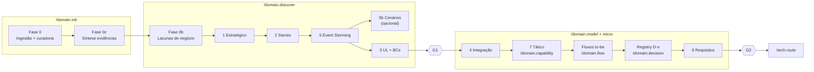

# Estágios do DDD Discovery — guia prático

Este documento explica **cada estágio da descoberta de domínio (DDD)**, para que serve, **como saber em qual estágio você está** e **qual comando do domain-kit aciona cada um**.

Referências canônicas:

- Pipeline e fases do domain-kit: [`pipeline.md`](pipeline.md)
- Comandos e cenários de uso: [`COMMAND-GUIDE.md`](../COMMAND-GUIDE.md)
- Skills bundled: [`../skills/README.md`](../skills/README.md)

O domain-kit cobre os **estágios 1–7** (descoberta + modelagem de domínio). Estágios 8+ (arquitetura, entrega, qualidade) pertencem ao **arch-kit** e **delivery-kit**, após o Gate G2.

---

## Visão geral

A descoberta DDD responde, em ordem lógica:

1. **O que é o negócio?** (estratégico)
2. **Quem faz o quê?** (narrativas)
3. **Que eventos acontecem?** (processo)
4. **Quais termos e fronteiras usamos?** (linguagem + BCs)
5. **Como os contextos se conectam?** (integração)
6. **O que o produto precisa fazer?** (requisitos)
7. **Como modelar por BC?** (tático)

No framework, esses estágios **não são sempre executados na ordem numérica**. O comando `/domain.discover` em modo `full` roda: **1 → 2 → 5 → 3** (stories e Event Storming antes de fechar linguagem e BCs).



---

## Camadas de comando do framework

Antes dos estágios, entenda **quem orquestra o quê**:

| Camada | Comandos | Papel |
| --- | --- | --- |
| **Hub** | `/domain.install` | Instala o framework no hub (1× por repositório) |
| **Meta** | `/domain.init`, `/domain.scan`, `/domain.status` | Bootstrap do produto, re-sync de fontes, diagnóstico |
| **Macro** | `/domain.discover`, `/domain.model` | Orquestram vários estágios em batch |
| **Micro** | `/domain.flow`, `/domain.capability`, `/domain.decision` | Uma unidade de trabalho por sessão (recomendado em produção) |

**Regra prática:** use comandos **macro** para orquestrar fases; use comandos **micro** (ou `--stage` no discover) para fechar **uma unidade por sessão** — recomendado em produção.

### Modelo de sessões

| Comando | Sessão | Entrega |
| --- | --- | --- |
| `/domain.init` | Fase 0c | `sintese-evidencias.md` |
| `/domain.discover` | 0b (abertura) | lacunas de negócio |
| `/domain.discover` | `--stage strategic` | `01-design-estrategico.md` |
| `/domain.discover` | `--stage stories` | 1+ domain story |
| `/domain.discover` | `--stage event-storming` | 1 workshop ES |
| `/domain.discover` | `--stage contexts` | desafio + UL + BCs → **G1** |

`/domain.discover` **não** entrega todos os artefatos G1 numa conversa. `--stage auto` escolhe o próximo pendente (0b ou DDD). `--stage full` percorre com **checkpoint** entre estágios.

---

## Pré-discovery e init (fases 0, 0c, 0b)

Estas fases **não têm número** no mapa global 1–7, mas são pré-requisito dos estágios DDD.

### Fase 0 — Ingestão de fontes (Gate G0)

| | |
| --- | --- |
| **Para que serve** | Coletar evidências externas (repos, docs, Confluence) antes de modelar o negócio |
| **Comando** | `/domain.init {produto}` (primeiro scan) ou `/domain.scan {produto}` (re-sync) |
| **Artefatos** | `01-product/00-scan/sources.yml`, `scan-manifest.json` |
| **Skills/wrappers** | `scan-github`, `scan-gitlab`, `scan-confluence` |

**Como identificar que você está aqui:**

- O produto ainda não tem pasta `01-product/00-scan/` ou manifest desatualizado
- `/domain.status` indica Gate **G0** pendente
- Você acabou de criar o produto no hub e precisa ler código/docs existentes

**Como identificar que terminou (G0 passou):**

- `scan-manifest.json` existe (ou skip documentado em `domain-status.json`)
- Gate G0 validado: `validate_gate.py --gate G0 --product {p}`
- Entrada em `CHANGELOG.md` registrada ([changelog.md](../../templates/clarify/changelog.md))

---

### Fase 0c — Síntese de evidências (no init)

| | |
| --- | --- |
| **Para que serve** | Consolidar o que foi achado no scan/enunciado antes de perguntar ou modelar |
| **Comando** | `/domain.init` (Fase 0c); refresh em `/domain.scan` se manifest mudou |
| **Artefato** | `01-product/00-scan/sintese-evidencias.md` |
| **Roteiro** | `templates/clarify/findings-brief.md` |

**Como identificar que você está aqui:**

- G0 passou (ou curadoria acabou), mas `sintese-evidencias.md` ainda não existe
- Agente deve exibir `## Síntese do que já sabemos` e aguardar confirmação

**Como identificar que terminou:**

- `sintese-evidencias.md` promovido; `discover.evidenceBrief = complete` em `domain-status.json`
- Handoff para `/domain.discover` (lacunas + DDD)

**Recovery legado:** `/domain.init --adopt` (Fase 0c) ou `/domain.discover --stage brief`.

---

### Fase 0b — Lacunas de negócio (no discover)

| | |
| --- | --- |
| **Para que serve** | Fechar **lacunas** de negócio antes de gerar artefatos DDD (atores, MVP, legado) |
| **Comando** | Inline no início de `/domain.discover` (não há comando separado) |
| **Artefatos** | `abertos.md` em `.draft/` se houver pendências |

**Pré-requisito:** `sintese-evidencias.md` promovido no init (ou refresh do scan).

**Como identificar que você está aqui:**

- Síntese existe; faltam respostas sobre itens listados em **Lacunas** na síntese
- O agente faz até **3 perguntas por turno** — **somente sobre lacunas**, não sobre fatos já na síntese

**Sinal de que pode avançar:** lacunas de negócio fechadas ou registradas em abertos; enunciado suficiente para o próximo `--stage` DDD.

---

## Estágio 1 — Design estratégico

| | |
| --- | --- |
| **Pergunta central** | Qual é o negócio? O que é subdomínio **principal**, de **suporte** e **genérico**? |
| **Para que serve** | Posicionar o produto no mapa de domínio antes de detalhar fluxos ou código |
| **Skill** | `ddd-design-estrategico` |
| **Comando** | `/domain.discover` |
| **Artefato** | `01-product/01-vision/01-design-estrategico.md` |

**Como identificar que você está aqui:**

- Não existe `01-design-estrategico.md` (ou está obsoleto após mudança de escopo)
- Você ainda não sabe o que é core vs suporte vs genérico
- `/domain.status` aponta `estrategico: false` em `domain-status.json`

**Como identificar que terminou:**

- Arquivo promovido com subdomínios nomeados e justificados
- Há insumo claro para stories, ES ou glossário (mesmo que ainda não existam)

**Confusão comum:** subdomínio estratégico **≠** Bounded Context. BCs são definidos no estágio 3.

---

## Estágio 2 — Domain Storytelling

| | |
| --- | --- |
| **Pergunta central** | Quem faz o quê, com quais objetos de trabalho, em que ordem? |
| **Para que serve** | Narrativas visuais que humanizam o domínio e alimentam glossário e Event Storming |
| **Skill** | `domain-storytelling` |
| **Comando** | `/domain.discover` |
| **Artefato** | `01-product/03-discovery/02-domain-storytelling/{NN}-{slug}.md` |

**Como identificar que você está aqui:**

- Design estratégico existe, mas jornadas ainda não estão contadas como histórias
- Domain Experts descrevem fluxos em linguagem natural, não em eventos
- Modo `full` e domínio não trivial (recomendado)

**Como identificar que terminou:**

- Pelo menos **2 histórias** promovidas (critério alternativo ao ES no Gate G1)
- Cada história tem atores, objetos de trabalho e sequência clara

**Quando pular:** modo `minimal` (CRUD simples, 1 BC) ou `as-is-first` (opcional).

---

## Estágio 5 — Event Storming

| | |
| --- | --- |
| **Pergunta central** | Que eventos ocorrem, em que ordem, com quais políticas e comandos? |
| **Para que serve** | Mapear o **processo de domínio** — linha do tempo, hot spots, regras |
| **Skill** | `event-storming` |
| **Comando** | `/domain.discover` (visão macro); `/domain.flow {NN}` (recorte por jornada entregável) |
| **Artefato** | `01-product/03-discovery/01-event-storming/README.md` + timelines PlantUML |

**Como identificar que você está aqui:**

- Há narrativas ou desafio de negócio, mas ainda não há timeline de eventos
- Discussão gira em torno de "o que acontece quando…" e políticas reativas
- `/domain.status` aponta `eventStorming: false`

**Como identificar que terminou:**

- Pasta `01-event-storming/` não vazia com pelo menos um workshop/timeline promovido
- Eventos de domínio, comandos e políticas identificados (hot spots em abertos se necessário)

**Nota:** pode rodar **em paralelo** com Domain Storytelling; ambos alimentam o estágio 3.

---

## Estágio 5b — Tabelas de cenário (opcional)

| | |
| --- | --- |
| **Pergunta central** | Como transformar o ES visual em tabelas acionáveis (comando → evento → política)? |
| **Para que serve** | Backlog detalhado por funcionalidade; ponte para requisitos e refinamento |
| **Skill** | `event-storming-to-scenario-tables` |
| **Comando** | `/domain.discover` |
| **Artefato** | `01-product/02-domain/cenarios/` |

**Como identificar que você está aqui:**

- Existe diagrama ES (SVG, draw.io) ou timeline ES consolidada
- Time precisa de tabelas por funcionalidade antes de requisitos formais

**Quando pular:** produto simples ou quando fluxos entregáveis (`/domain.flow`) já cobrem o detalhe necessário.

---

## Estágio 3 — Linguagem ubíqua + Bounded Contexts

| | |
| --- | --- |
| **Pergunta central** | Quais termos usamos? O que é ambíguo? Onde passam as fronteiras do modelo? |
| **Para que serve** | Fechar **fronteiras de linguagem** — base para integração, tático e implementação |
| **Skill** | `ddd-linguagem-e-contextos` |
| **Comando** | `/domain.discover` |
| **Artefatos** | `01-product/02-domain/desafio-negocio.md`, `linguagem-ubiqua.md`, `bounded-contexts.md` |

**Como identificar que você está aqui:**

- Estratégico + (ES ou stories) existem, mas BCs ainda não estão nomeados
- Termos conflitantes entre áreas ("cliente" significa coisas diferentes)
- `/domain.status` aponta `boundedContexts: false`

**Como identificar que terminou (Gate G1):**

- `bounded-contexts.md` lista BCs do MVP com slugs estáveis (`ordem-de-servico`, etc.)
- Desafio de negócio articulado; glossário com ambiguidades resolvidas ou em abertos
- Validação: `validate_gate.py --gate G1 --product {p}` → **PASS**

**Handoff H1:** após G1 → `/domain.model` ou começar micro com `/domain.flow 01`.

---

## Gate G1 — checklist rápido

| Critério | Como verificar |
| --- | --- |
| G1.1 Design estratégico | `01-design-estrategico.md` promovido |
| G1.2 ES **ou** ≥2 stories | Pasta `01-event-storming/` não vazia **ou** ≥2 arquivos em `02-domain-storytelling/` |
| G1.3 BCs nomeados | `bounded-contexts.md` com lista de BCs |
| G1.4 Termos ambíguos | Resolvidos no glossário ou listados em abertos |

Comando de diagnóstico: `/domain.status {produto}`.

---

## Estágio 4 — Integração entre contextos

| | |
| --- | --- |
| **Pergunta central** | Como os BCs se relacionam? Quem é upstream/downstream? Onde entra ACL? |
| **Para que serve** | Definir contratos **entre** contextos antes do design tático de BCs acoplados |
| **Skill** | `ddd-integracao-contextos` |
| **Comando** | `/domain.model` (sem `--finalize`) |
| **Artefato** | `01-product/04-integration/01-contextos.md` |

**Como identificar que você está aqui:**

- G1 passou; BCs existem, mas integrações ainda são implícitas ("Orçamento chama Estoque")
- Você vai modelar tático de BCs que trocam dados ou eventos

**Como identificar que terminou:**

- Mapa de relações documentado (Conformista, ACL, Customer/Supplier, etc.)
- Decisões estruturais registradas como D-n quando impactam código

**Ordem importante:** integração **antes** do tático dos BCs fortemente acoplados.

---

## Estágio 7 — Design tático (por BC)

| | |
| --- | --- |
| **Pergunta central** | Quais agregados, entidades, VOs e invariantes existem **neste** BC? |
| **Para que serve** | Modelo implementável dentro de cada contexto delimitado |
| **Skill** | `ddd-design-tatico` |
| **Comando** | `/domain.capability {bc}` (recomendado) ou `/domain.model` |
| **Artefatos** | `02-capabilities/{bc}/design-tatico.md`, `README.md` |

**Como identificar que você está aqui:**

- BC `{bc}` listado em `bounded-contexts.md`, mas sem `design-tatico.md`
- Discussão sobre agregados, invariantes ou camadas **dentro** de um contexto

**Como identificar que terminou (por BC):**

- `design-tatico.md` promovido com agregados raiz e regras de consistência
- README do BC linka tático + fluxos

**Repetir** para cada BC do MVP.

---

## Fluxos entregáveis (to-be) — extensão do estágio 7

| | |
| --- | --- |
| **Pergunta central** | Passo a passo do que o sistema **entrega** por jornada? |
| **Para que serve** | Unidade de entrega que vira 1 Tech Story na delivery-kit |
| **Skill** | `fluxos-entregaveis` |
| **Comando** | `/domain.flow {NN}` (1 fluxo = 1 sessão) |
| **Artefato** | `02-capabilities/{bc}/fluxos/{NN}-{slug}.md` |

**Como identificar que você está aqui:**

- Tático existe (ou BC está claro), mas jornadas to-be não estão numeradas
- Gate G2 exige **≥1 fluxo** promovido

**Regra:** `fluxo-01`, `fluxo-02`, … — IDs estáveis referenciados por arch-kit e delivery-kit.

---

## Registry — decisões de produto (transversal ao model)

| | |
| --- | --- |
| **Para que serve** | Registrar regras que impactam código com ID estável `D-{nn}` |
| **Comando** | `/domain.decision` |
| **Artefato** | `03-registry/produto.md` |

**Como identificar que você está aqui:**

- Regra de negócio tomada na sessão mas ainda só no chat ou em draft
- G2 exige registry com D-n do escopo

**Regra:** toda regra que impacta código **deve** ter D-n ou estar em **Abertos** explícitos.

---

## Estágio 6 — Requisitos de produto

| | |
| --- | --- |
| **Pergunta central** | Persona, jornada, RF (funcional) e RNF (não funcional)? Riscos Cagan? |
| **Para que serve** | Contrato de produto consumido por arquitetura e entrega |
| **Skill** | `levantamento-requisitos` |
| **Comando** | `/domain.model --finalize` |
| **Artefato** | `04-platform/01-non-functional/01-requisitos.md` |

**Como identificar que você está aqui:**

- Domínio modelado (integração + tático + fluxos), mas RF/RNF ainda dispersos
- Preparando handoff para arch-kit (Gate G2)

**Como identificar que terminou (Gate G2):**

- `01-requisitos.md` promovido
- G2 completo: `validate_gate.py --gate G2 --product {p}` → **PASS**
- Handoff **H2** → `/arch.route`

---

## Gate G2 — checklist rápido

| Critério | Artefato |
| --- | --- |
| G2.1 Integração | `01-product/04-integration/01-contextos.md` |
| G2.2 Tático por BC do MVP | `02-capabilities/{bc}/design-tatico.md` (todos os BCs) |
| G2.3 Fluxos numerados | ≥1 em `02-capabilities/{bc}/fluxos/` |
| G2.4 Registry | `03-registry/produto.md` com D-n do escopo |
| G2.5 Requisitos | `04-platform/01-non-functional/01-requisitos.md` |
| G2.6 Orquestração cross-BC | `fluxos-aplicacao.md` (se aplicável) |

---

## As-is (legado) — paralelo, não numerado

Para sistemas **já em produção**, o framework usa trilha paralela:

| Skill | Comando | Artefato | Quando |
| --- | --- | --- | --- |
| `fluxogramas-decisao` | `/domain.discover --mode as-is-first` | `02-capabilities/{bc}/fluxogramas-decisao/` | Documentar regras **atuais** |
| `database-model` | `/arch.route` (arch-kit) | `04-platform/02-data/02-database-model.md` | Schema físico legado |

**Como identificar:** código existe, docs pobres, time precisa entender o que **já roda** antes do to-be.

**Fronteira:** domain-kit = regras de negócio (as-is + to-be). arch-kit = persistência física.

---

## Matriz estágio → comando → skill

| Estágio / Fase | Pergunta resumida | Comando principal | Comando secundário | Skill |
| --- | --- | --- | --- | --- |
| **0** Ingestão | O que já existe nos repos/docs? | `/domain.init` | `/domain.scan` | scan-* |
| **0c** Síntese | O que já sabemos das fontes? | `/domain.init` | `/domain.scan` (refresh) | `findings-brief` |
| **0b** Lacunas | Quem, MVP, legado? | `/domain.discover` (inline) | — | clarify |
| **1** Estratégico | Core / suporte / genérico? | `/domain.discover` | — | `ddd-design-estrategico` |
| **2** Stories | Quem faz o quê? | `/domain.discover` | — | `domain-storytelling` |
| **5** Event Storming | Que eventos ocorrem? | `/domain.discover` | `/domain.flow` | `event-storming` |
| **5b** Cenários | Tabelas comando/evento? | `/domain.discover` | — | `event-storming-to-scenario-tables` |
| **3** UL + BCs | Termos e fronteiras? | `/domain.discover` | — | `ddd-linguagem-e-contextos` |
| **4** Integração | Como BCs se conectam? | `/domain.model` | — | `ddd-integracao-contextos` |
| **7** Tático | Agregados por BC? | `/domain.capability {bc}` | `/domain.model` | `ddd-design-tatico` |
| **Fluxos** | Jornada to-be? | `/domain.flow {NN}` | `/domain.model` | `fluxos-entregaveis` |
| **Decisões** | Regra D-n? | `/domain.decision` | — | — |
| **6** Requisitos | RF/RNF? | `/domain.model --finalize` | — | `levantamento-requisitos` |
| **As-is** | Regras legadas? | `/domain.discover --mode as-is-first` | — | `fluxogramas-decisao` |

---

## Modos de execução e impacto nos estágios

| Modo | Comando | Estágios afetados | Comportamento |
| --- | --- | --- | --- |
| `full` | `/domain.discover` | 1, 2, 5, 3 | Sequência completa (default greenfield) |
| `minimal` | `/domain.discover` | 1, 3 | Pula stories e ES; G1 relaxado |
| `as-is-first` | `/domain.discover` | as-is → 3 → (2,5 opc.) | Prioriza fluxogramas-decisao |
| `incremental` | `/domain.discover --bc {bc}` | delta 3 + discovery do BC | Nova capability pós-G2 |
| `incremental` | `/domain.model --finalize --bc {bc}` | G2 parcial | Valida só o BC novo |

Declarar o modo no início da sessão.

---

## Pipeline recomendado (produto novo)

```text
/domain.install                         # 1× hub
/domain.init {produto}                  # Fase 0 + 0c → G0 + síntese
/domain.discover                        # 0b lacunas → estágios DDD → G1
/domain.flow 01 … NN                    # Fluxos to-be (micro)
/domain.capability {bc}                 # Estágio 7 por BC (micro)
/domain.decision                        # D-n conforme regras surgem
/domain.model                           # Estágio 4 (integração)
/domain.model --finalize                # Estágio 6 + G2
/arch.route                             # arch-kit (estágios 8+)
```

Diagnóstico a qualquer momento: `/domain.status {produto}`.

---

## Como saber em qual estágio estou? (decisão rápida)

```text
Não tenho produto no hub?
  → /domain.install + /domain.init

Tenho produto mas sem scan?
  → Fase 0 — /domain.init ou /domain.scan

Tenho scan mas sem design estratégico?
  → Estágio 1 — /domain.discover

Tenho estratégico mas sem stories nem ES?
  → Estágios 2 ou 5 — /domain.discover (modo full)

Tenho ES/stories mas BCs indefinidos?
  → Estágio 3 — /domain.discover

G1 passou mas sem mapa de integração?
  → Estágio 4 — /domain.model

Integração ok mas BC sem tático?
  → Estágio 7 — /domain.capability {bc}

Tático ok mas sem jornadas to-be?
  → /domain.flow {NN}

Quase pronto para arquitetura?
  → /domain.decision + /domain.model --finalize (estágio 6 + G2)

Não sei?
  → /domain.status {produto}
```

---

## O que fica fora do domain-kit

| Estágio global | Kit | Comando típico |
| --- | --- | --- |
| 8 Estilo (Hex/Clean/…) | arch-kit | `/arch.style` |
| 9 HLD/LLD/C4 | arch-kit | `/arch.design` |
| 10 DAS | arch-kit | `/arch.approve` |
| 11 Backlog | delivery-kit | `/delivery.backlog` |
| 12 Qualidade | delivery-kit | `/delivery.quality` |
| 13 Débito técnico | delivery-kit | `/delivery.debt` |

Handoff **H2** (G2 → arch-kit) é o limite explícito do domain-kit.

---

## Leitura complementar

- [COMMAND-GUIDE.md](../COMMAND-GUIDE.md) — árvore de decisão e cenários legado/adopt
- [pipeline.md](pipeline.md) — diagrama completo e exemplo oficina-mecanica
- [gates.yml](gates.yml) — critérios executáveis G0/G1/G2
- [examples-oficina.md](examples-oficina.md) — walkthrough real com todos os estágios
- [plan-mode.md](plan-mode.md) — contrato rascunho → OK → promote
