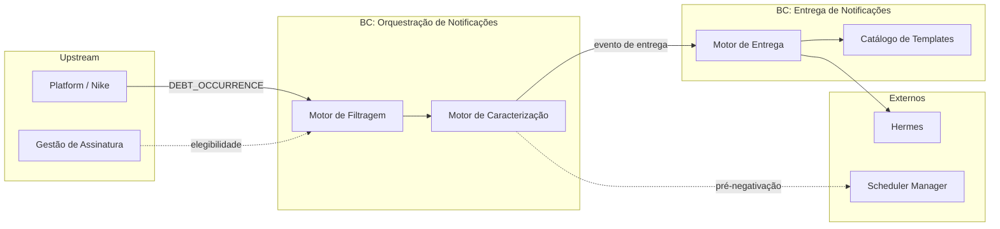

# Bounded Contexts — Notificação de Dívidas e Pendências

> Gerado em 2026-09-03 via `/domain.discover --stage contexts` (modo as-is-first).
> Decisão L02: dois BCs — Orquestração + Entrega.

> Detalhe técnico de integração (ACL, protocolos, filas): [`arch/01-integration/01-contextos.md`](../../arch/01-integration/01-contextos.md).

## Visão geral

---

## BC-1: Orquestração de Notificações

| Atributo | Valor |
| --- | --- |
| **Tipo de subdomínio** | Core |
| **Responsabilidade** | Decidir **se**, **quando** e **como** notificar sobre ocorrência de dívida |
| **Dono sugerido** | Time Premium Proteções / Antifraude |

### Capacidades

| Capacidade | Descrição |
| --- | --- |
| Filtrar elegibilidade | Validar assinatura premium PF/PJ |
| Publicar evento aprovado | Encaminhar ocorrência elegível para caracterização |
| Caracterizar ocorrência | Aplicar regras por tipo de débito e operação |
| Validar datas | Janela de 5 dias, data de disponibilidade |
| Agendar pré-negativação | Carta para data futura |
| Consultar credor | Nome da empresa credora |

### Entrada

| Artefato | Origem |
| --- | --- |
| Ocorrência de dívida | Platform / Nike |
| Assinatura premium | Gestão de Assinatura |

### Saída

| Artefato | Destino |
| --- | --- |
| Evento de entrega | BC Entrega |
| Agendamento de pré-negativação | Scheduler |
| Motivo de descarte | Observabilidade (métricas de produto) |

### Regras invariantes

1. PF sem subscription → não publica
2. PJ sem company → não publica
3. `availabilityDate` ausente → não notifica (`AVAILABILITY_DATE_REQUIRED`)
4. Datas fora da janela de 5 dias → não notifica (compliance)
5. Data de disponibilidade futura → pré-negativação, não push imediato

---

## BC-2: Entrega de Notificações

| Atributo | Valor |
| --- | --- |
| **Tipo de subdomínio** | Supporting |
| **Responsabilidade** | Montar mensagem e **entregar** por canais configurados |
| **Dono sugerido** | Time Premium Proteções / Antifraude |

### Capacidades

| Capacidade | Descrição |
| --- | --- |
| Resolver campanha | Mapear tipo de evento → template + canais |
| Montar mensagem | Formatar parâmetros (data, valor, credor) |
| Entregar multicanal | Push, e-mail, SMS, central |
| Gerenciar templates | Catálogo por parceiro/produto |

### Entrada

| Artefato | Origem |
| --- | --- |
| Evento de entrega | BC Orquestração |
| Template de campanha | Catálogo de templates |

### Saída

| Artefato | Destino |
| --- | --- |
| Notificação multicanal | Cliente premium |

### Canais por campanha (padrão)

| Canal | Status |
| --- | --- |
| SMS | Habilitado |
| Push | Habilitado |
| E-mail | Habilitado |
| Central de notificações | Habilitada |
| WhatsApp | **Desabilitado** |

---

## Contextos externos (fora dos BCs)

| Contexto | Papel |
| --- | --- |
| **Platform / Nike** | Publica ocorrências de dívida |
| **Gestão de Assinatura** | Valida premium |
| **Hermes** | Envio físico das mensagens |
| **Scheduler Manager** | Disparo futuro de pré-negativação |
| **Split (feature flags)** | Liga/desliga cenários do produto |

---

## Contextos explicitamente fora de escopo

| Contexto | Motivo |
| --- | --- |
| Relatórios (report-builder, consumer-report) | Produto diferente — leitura, não notificação |
| Área logada | Visualização, não alerta |
| Freemium (note-rules-free) | Outro produto |
| TribeCS / process-debts | Legado desligado em PRD |
| process-filter-spring | Outros use cases (consultas, verificação) |

---

## Mapa de contexto (linguagem de negócio)

| De | Para | O que flui |
| --- | --- | --- |
| Platform / Nike | Orquestração | Ocorrência de dívida |
| Gestão de Assinatura | Orquestração | Elegibilidade premium |
| Orquestração | Entrega | Evento de entrega tipado |
| Entrega | Cliente premium | Notificação multicanal |
| Orquestração | Scheduler | Agendamento de pré-negativação |

---

## Referências

- `01-product/01-vision/01-design-estrategico.md` (seção 6–7)
- `01-product/02-domain/linguagem-ubiqua.md`
- `arch/01-integration/01-contextos.md` — integração técnica (arch-kit)
- `01-product/03-discovery/00-as-is/fluxo-notificacao-prd-datadog.md`
