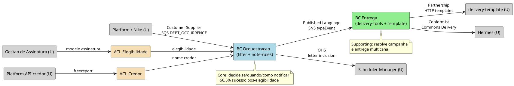
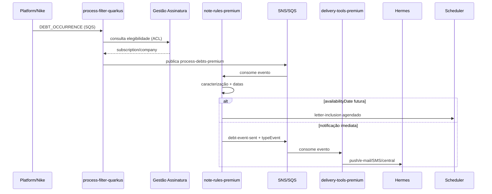

# Integração de Contextos — Notificação de Dívidas e Pendências

> **Arch-kit** — detalhe técnico de integração entre contextos.
> Mapa de negócio: `01-product/02-domain/bounded-contexts.md`.

## Sumário

| Campo | Valor |
| --- | --- |
| Feature / sistema | Notificação de Dívidas e Pendências (motor premium) |
| BCs internos | Orquestração de Notificações, Entrega de Notificações |
| Fontes | `bounded-contexts.md`, design estratégico, domain stories, fluxo Datadog PRD |
| Data | 2026-09-03 |

---

## 1. Contextos envolvidos

| Contexto | Time dono | Tipo | Papel típico (U/D) |
| --- | --- | --- | --- |
| **Platform / Nike** | Platform | Upstream externo | **U** — publica `DEBT_OCCURRENCE` |
| **Gestão de Assinatura** | Premium / Assinatura | Generic | **U** — consultado para elegibilidade |
| **BC Orquestração de Notificações** | Premium Proteções / Antifraude | Core | **D** (Nike, Assinatura) · **U** (Entrega, Scheduler) |
| **BC Entrega de Notificações** | Premium Proteções / Antifraude | Supporting | **D** (Orquestração) · **U** (Hermes) |
| **delivery-template** | Premium Proteções / Antifraude | Supporting | **U** — catálogo de templates |
| **Hermes / Commons Delivery** | Comunicação | Generic externo | **U** — envio físico multicanal |
| **Scheduler Manager** | Infra / Premium | Generic externo | **U** — disparo futuro (pré-negativação) |
| **Platform API (credor)** | Platform | Upstream externo | **U** — nome da empresa credora |
| **Split (feature flags)** | Infraestrutura | Transversal | Habilita use cases e tipos de débito |

---

## 2. Relações

| Upstream (U) | Downstream (D) | Padrão | Justificativa |
| --- | --- | --- | --- |
| Platform / Nike | BC Orquestração | **Customer-Supplier** | Nike define contrato `DEBT_OCCURRENCE`; antifraude consome sem negociar formato |
| Gestão de Assinatura | BC Orquestração | **ACL** | Filter traduz modelo subscription/company para elegibilidade interna |
| BC Orquestração | BC Entrega | **Published Language** | Eventos tipados (`typeEvent` + `parameters`) via SNS — linguagem compartilhada estável |
| BC Entrega | Hermes | **Conformist** | Motor de entrega adapta-se ao protocolo Commons Delivery |
| BC Entrega | delivery-template | **Partnership** | Mesmo ecossistema/time; templates por campanha (partner 11, product 427) |
| BC Orquestração | Scheduler Manager | **Open Host Service** | API de agendamento genérica; `idTrigger` = userId + debtId |
| Platform API (credor) | BC Orquestração | **ACL** | `note-rules` traduz resposta freereport para parâmetro de campanha |
| BC Orquestração | Gestão de Assinatura | **ACL** (consulta) | Dados de contato indiretos via delivery-tools em alguns fluxos |

### Detalhe — Platform / Nike → BC Orquestração

- **Protocolo / modelo em jogo:** SQS `antifraude-process-debts-ocurrence-prd` + JSON `DEBT_OCCURRENCE` (`fileType`, `operationType`, `availabilityDate`, `inclusionDate`, `deletedDate`, CPF/CNPJ)
- **Quem manda:** Platform/Nike (upstream)
- **Padrão escolhido:** Customer-Supplier — time Platform é dono do contrato de dados (lacuna P04/P07)
- **ACL:** não aplicável no consumo da fila; o filter consome o payload Nike diretamente. Risco: ~15K/dia de `AVAILABILITY_DATE_REQUIRED` quando contrato incompleto

### Detalhe — Gestão de Assinatura → BC Orquestração

- **Protocolo / modelo em jogo:** HTTP interno — `consumer-sub` (PF), `process-sub-pj` (PJ)
- **Quem manda:** Gestão de Assinatura (upstream)
- **Padrão escolhido:** ACL no `process-filter-quarkus`
- **ACL:** traduz subscription/company para decisão binária de elegibilidade; isola modelo de assinatura do domínio de notificação. ~90% dos eventos descartados aqui (comportamento esperado)

### Detalhe — BC Orquestração → BC Entrega

- **Protocolo / modelo em jogo:** SNS `process-rules-topic` → SQS premium → publicação `debt-event-sent` / `letter-inclusion` com `typeEvent` + `parameters`
- **Quem manda:** Orquestração (upstream na relação)
- **Padrão escolhido:** Published Language — catálogo de `typeEvent` documentado em `linguagem-ubiqua.md`
- **ACL:** não necessária — Entrega é conformista inbound ao vocabulário publicado pela Orquestração

### Detalhe — BC Entrega → Hermes

- **Protocolo / modelo em jogo:** HTTP Commons Delivery (push, e-mail, SMS, central)
- **Quem manda:** Hermes (upstream global)
- **Padrão escolhido:** Conformist — `delivery-tools-premium` adapta campanha ao modelo Hermes
- **ACL:** não aplicável — subdomínio supporting compartilhado com outros produtos premium

### Detalhe — BC Orquestração → Scheduler Manager

- **Protocolo / modelo em jogo:** AWS Scheduler API — `letter-inclusion` com `availabilityDate` futura
- **Quem manda:** Scheduler (OHS genérico)
- **Padrão escolhido:** Open Host Service — ~391 agendamentos/dia em PRD
- **ACL:** mínima — mapeamento `idTrigger` = userId + debtId no note-rules

### Detalhe — Platform API (credor) → BC Orquestração

- **Protocolo / modelo em jogo:** `platform-freereport-offline` — consulta nome do credor para parâmetros de campanha
- **Quem manda:** Platform API
- **Padrão escolhido:** ACL no `note-rules-premium`
- **ACL:** traduz resposta externa para campo `credor` no evento de entrega; isola variações de API Platform do modelo de caracterização

---

## 3. PlantUML — mapa de integração

---

## 4. Contratos de integração (Published Language)

### Entrada — `DEBT_OCCURRENCE` (Nike → Orquestração)

| Campo | Obrigatório | Uso |
| --- | --- | --- |
| `fileType` | Sim | Tipo de débito (PEFIN, REFIN, CCF…) |
| `operationType` | Sim | I (inclusão), E (exclusão), D (remoção) |
| `availabilityDate` | **Sim** (P04) | Pré-negativação ou validação de janela |
| `inclusionDate` | Condicional | Inclusão — janela de 5 dias |
| `deletedDate` | Condicional | Exclusão/remoção — janela de 5 dias |
| CPF/CNPJ | Sim | Elegibilidade + entrega |

### Saída — evento de entrega (Orquestração → Entrega)

| Campo | Descrição |
| --- | --- |
| `typeEvent` | Identificador de template (ex.: `debt-occurrence-inclusion-pf`) |
| `parameters` | Data, valor, credor, persona (PF/PJ) |
| `userId` | Destinatário premium |

### Catálogo principal de `typeEvent`

| Cenário | typeEvent (PF) | Campanha |
| --- | --- | --- |
| Inclusão débito privado | `debt-occurrence-inclusion-pf` | `saf-PREMIUM_TRAN_ALERTA_DIVIDAENCONTRADA` |
| Remoção débito privado | `debt-occurrence-remove-pf` | `saf-PREMIUM_TRAN_DIVREMOVIDA_CPF` |
| Cheque sem fundo | `check-records-inclusion` / `-remove` | — |
| Protesto | `notary-records-inclusion` / `-remove` | — |
| Ação judicial | `judgements-filings-inclusion` / `-remove` | — |
| Falência | `bankrupts-inclusion` / `-remove` | — |
| Pré-negativação | `letter-inclusion` | Agendado via Scheduler |

> PJ usa sufixo `-pj` nos eventos de débito privado.

---

## 5. Critérios ACL aplicados

| Relação | Critério: D contém subdomínio principal | Modelo U inadequado | Protocolo U instável | Decisão |
| --- | --- | --- | --- | --- |
| Assinatura → Orquestração | **Sim** (core) | Sim — modelo subscription ≠ ocorrência | Baixa | **ACL** no filter |
| Credor API → Orquestração | **Sim** (core) | Sim — API freereport ≠ parâmetros campanha | Média (migração Nike) | **ACL** no note-rules |
| Nike → Orquestração | Sim | Parcial — payload incompleto (P04) | Média | **Sem ACL** — pressão no contrato upstream |
| Orquestração → Entrega | Não (supporting downstream) | Não | Baixa | **Published Language** |
| Entrega → Hermes | Não (supporting) | Não | Baixa | **Conformist** |

---

## 6. Fluxo de mensagens (resumo técnico)

---

## 7. Riscos de integração

| Risco | Relação afetada | Mitigação |
| --- | --- | --- |
| `availabilityDate` ausente (~15K/dia) | Nike → Orquestração | SLI + alinhamento contrato (P04, owner Platform) |
| Mudança de payload Nike sem aviso | Nike → Orquestração | Monitorar spike de skip reasons; testes de contrato |
| Resíduos TribeCS pós-migração | Nike → Orquestração | Inventário flags (P09); remover `client-tribecs` |
| Divergência PF/PJ em campanhas | Orquestração → Entrega | Checklist P03; mapeamento Confluence |
| Erro Hermes pós-regras | Entrega → Hermes | Baixo volume em PRD; alertas delivery-tools |

---

## 8. Decisões propostas (registrar via `/domain.decision`)

| ID proposto | Título | Relação | Status |
| --- | --- | --- | --- |
| D-01 | ACL de elegibilidade no process-filter | Assinatura → Orquestração | Proposta |
| D-02 | Published Language para eventos de entrega | Orquestração → Entrega | Proposta |
| D-03 | Conformist com Hermes no delivery-tools | Entrega → Hermes | Proposta |
| D-04 | Contrato Nike: `availabilityDate` obrigatório | Nike → Orquestração | Proposta (ref. P04/P07) |

---

## 9. Abertos

- [ ] Confirmar endpoint de credor pós-migração Nike (`platform-freereport-offline` vs alternativa)
- [ ] Validar paridade PF/PJ no catálogo de `typeEvent` (lacuna P03)
- [ ] Inventariar resíduos TribeCS que ainda aparecem em APM (`antifraude-client-tribecs`)
- [ ] Definir SLA de latência Nike → SQS para reduzir rejeições por data expirada (P05)
- [ ] Registrar D-01 a D-04 formalmente após validação com times

---

## Referências

- `01-product/02-domain/bounded-contexts.md`
- `01-product/02-domain/linguagem-ubiqua.md`
- `01-product/03-discovery/02-domain-storytelling/`
- `01-product/03-discovery/00-as-is/fluxo-notificacao-prd-datadog.md`
- `01-product/02-domain/abertos.md`
