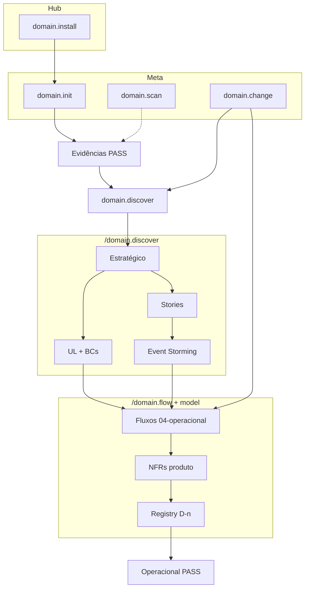

# Pipeline do domain-kit

Fases **Evidências → Estratégico → Descoberta → Operacional**. O pipeline do domain-kit termina em **Operacional**. Detalhe técnico (design tático, integração, C4) fica **fora do escopo do domain-kit**.

Placeholders: `{produto}`, `{bc}`, `{iniciativa}`.

Guia: [`../COMMAND-GUIDE.md`](../COMMAND-GUIDE.md) · Estágios: [`discovery-workflow.md`](discovery-workflow.md) · Critérios: [`gates.yml`](gates.yml)

---

## Camadas de comandos

| Camada | Comandos |
| --- | --- |
| Hub | `domain.install` |
| Meta | `domain.init`, `domain.scan`, `domain.status`, `domain.change` |
| Macro | `domain.discover`, `domain.model` |
| Micro | `domain.flow`, `domain.decision` |

`domain.capability` — **fora do escopo do domain-kit** (próxima etapa técnica).

---

## Ingestão de fontes (Evidências)

Ver [`../wrappers/scan-github.md`](../wrappers/scan-github.md). Saída: `01-product/00-scan/`.

Primeiro scan em **`/domain.init`**. Re-sync: **`/domain.scan`**.

---

## Visão



---

## Mapa fase → artefatos

| Fase | Artefatos |
| --- | --- |
| Evidências | `sources.yml`, `00-scan/`, `sintese-evidencias.md`, `product-README.md` (stub) |
| Estratégico | `01-design-estrategico.md`, `desafio-negocio.md`, `bounded-contexts.md`, `linguagem-ubiqua.md` |
| Descoberta | `03-discovery/01-event-storming/`, `02-domain-storytelling/`, `abertos.md` |
| Operacional | `04-operacional/fluxos/`, `flows-registry.yml`, `requisitos.md`, `05-decisoes/produto.md` |

Fora do escopo do domain-kit: design tático, integração técnica, fluxos técnicos (próxima etapa técnica).

---

## Paths de fluxo

| Camada | Path |
| --- | --- |
| **Negócio (domain-kit)** | `products/{p}/01-product/04-operacional/fluxos/{NN}-{slug}.md` |

Fluxos de negócio: `01-product/04-operacional/fluxos/`. Mapa: [hub-paths.md](hub-paths.md).

Wrapper autoridade: [`../wrappers/fluxos-entregaveis.md`](../wrappers/fluxos-entregaveis.md).

---

## Validação

```bash
.domain/scripts/validate_gate.py --phase evidencias --product {p}
.domain/scripts/validate_gate.py --phase operacional --product {p} --suggest
```
