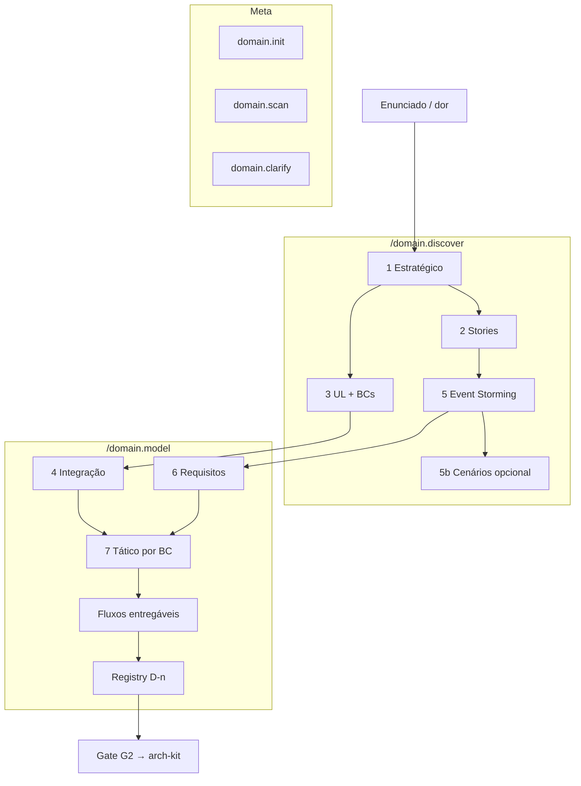

# Pipeline do domain-kit

Estágios **1–7** de [estagios-desenvolvimento.md](../../../estagios-desenvolvimento.md), em camadas **meta / macro / micro**.

Placeholders: `{produto}`, `{bc}`, `{iniciativa}`.

---

## Camadas de comandos

| Camada | Comandos |
| --- | --- |
| Meta | `workkit.init`, `domain.init`, `domain.scan`, `domain.clarify`, `domain.status` |
| Macro | `domain.discover`, `domain.model` |
| Micro | `domain.flow`, `domain.capability`, `domain.decision` |

Wrappers: [`../wrappers/`](../wrappers/) — não editar skills DDD originais.

---

## Scan (G0) — antes do discover

Ver [`../wrappers/scan-github.md`](../wrappers/scan-github.md). Saída: `01-product/00-scan/`.

---

## Visão

---

## Fase 0 — Entrada (antes do kit)

| Input | Onde | Obrigatório |
| --- | --- | --- |
| Enunciado ou narrativa do negócio | `initiatives/{i}/01-enunciado.md` ou chat | sim |
| Produto no hub | `products/{produto}/` | criar se novo |
| Iniciativa (se prazo) | `initiatives/{i}/` | recomendado |

**Não inventar:** persona, volume, integrações externas não mencionadas.

---

## `/domain.discover` — Estágios 1–5

Objetivo: **entender o negócio** e fechar **fronteiras de linguagem** (BCs).

### Estágio 1 — Design estratégico

| | |
| --- | --- |
| Pergunta | Qual é o negócio? O que é principal / suporte / genérico? |
| Skill | `ddd-design-estrategico` |
| Artefato | `01-product/01-vision/01-design-estrategico.md` |
| Oficina | Subdomínio principal = ciclo OS; suporte = estoque, cadastros; genérico = acesso/JWT |

### Estágio 2 — Domain Storytelling (opcional mas recomendado)

| | |
| --- | --- |
| Pergunta | Quem faz o quê, com quais objetos, em que ordem? |
| Skill | `domain-storytelling` |
| Artefato | `01-product/03-discovery/02-domain-storytelling/{NN}-{slug}.md` |
| Oficina | 6 histórias (01 abertura → 06 cliente acompanha) |

Pode rodar **em paralelo** com Event Storming; stories ajudam glossário.

### Estágio 5 — Event Storming

| | |
| --- | --- |
| Pergunta | Que eventos ocorrem, em que ordem, com quais políticas? |
| Skill | `event-storming` |
| Artefato | `01-product/03-discovery/01-event-storming/README.md` + timelines |
| Oficina | 5 workshops (identificação → exceções estoque) |

### Estágio 5b — Tabelas de cenário (opcional)

| | |
| --- | --- |
| Skill | `event-storming-to-scenario-tables` |
| Artefato | `01-product/02-domain/cenarios/` |
| Quando | ES visual (SVG) ou necessidade de backlog detalhado por comando/evento |

### Estágio 3 — Linguagem ubíqua + Bounded Contexts

| | |
| --- | --- |
| Pergunta | Quais termos usamos? Onde passam as fronteiras do modelo? |
| Skill | `ddd-linguagem-e-contextos` |
| Artefatos | `02-domain/desafio-negocio.md`, `linguagem-ubiqua.md`, `bounded-contexts.md` |
| Oficina | 5 BCs: ordem-de-servico, orcamento, estoque, cadastros, acesso |

**Gate interno discover:** BCs nomeados + desafio articulado → habilita G1.

---

## Gate G1 — Fim do discover

| # | Critério |
| --- | --- |
| G1.1 | `01-design-estrategico.md` existe |
| G1.2 | Pelo menos ES **ou** ≥2 domain stories |
| G1.3 | `bounded-contexts.md` com lista de BCs |
| G1.4 | Termos ambíguos listados em abertos ou resolvidos no glossário |

Emitir handoff **H1** (discover → model) — ver [handoffs.md](../../references/handoffs.md).

---

## `/domain.model` — Estágios 4, 6, 7 + fluxos + registry

Objetivo: **modelo implementável** — tático, fluxos, decisões D-n, requisitos.

### Estágio 4 — Integração entre contextos

| | |
| --- | --- |
| Pergunta | Como BCs se relacionam? Quem é upstream/downstream? ACL? |
| Skill | `ddd-integracao-contextos` |
| Artefato | `01-product/04-integration/01-contextos.md` |
| Oficina | D-16: Orçamento não chama Estoque; OS orquestra via ACL |

**Ordem:** integração **antes** do design tático dos BCs acoplados.

### Estágio 6 — Requisitos

| | |
| --- | --- |
| Pergunta | RF/RNF do produto (persona, jornada, riscos Cagan) |
| Skill | `levantamento-requisitos` |
| Artefato | `04-platform/01-non-functional/01-requisitos.md` |
| Nota | Vive em `04-platform/` mas é **owned** pelo domain-kit na fase model |

### Estágio 7 — Design tático (por BC)

| | |
| --- | --- |
| Pergunta | Agregados, camadas, invariantes **deste** BC |
| Skill | `ddd-design-tatico` |
| Artefato | `02-capabilities/{bc}/design-tatico.md` + `README.md` |
| Oficina | 3 agregados núcleo: OrdemDeServico, Orcamento, ItemEstoque |

**Por BC do MVP:** repetir tático antes dos fluxos daquele BC.

### Fluxos entregáveis (to-be)

| | |
| --- | --- |
| Pergunta | Passo a passo do que o sistema entrega por jornada |
| Skill | `fluxos-entregaveis` (ou manual alinhado ao template hub) |
| Artefato | `02-capabilities/{bc}/fluxos/{NN}-{slug}.md` |
| Oficina | 7 fluxos numerados 01–07 (podem estar em BCs diferentes) |

Regra oficina: **1 fluxo entregável = 1 unidade de entrega** (vira 1 Tech Story na delivery-kit).

### Orquestração application (cross-BC)

| | |
| --- | --- |
| Artefato | `02-capabilities/ordem-de-servico/fluxos-aplicacao.md` |
| Quando | Fluxos atravessam BCs (casos de uso na application layer) |
| Oficina | Catálogo de use cases que coordenam cadastros + OS + orçamento + estoque |

### Registry — decisões de produto

| | |
| --- | --- |
| Artefato | `03-registry/produto.md` |
| Formato | Tabela D-n: capability, tema, status, decisão, link evidência |
| Template | `architecture-hub/_conventions/decisao-template.md` |
| Oficina | D-01…D-33 |

**Regra:** toda regra que impacta código **deve** ter D-n ou estar em **Abertos** explícitos.

### As-is em paralelo (legado)

| Skill | Artefato | Quando |
| --- | --- | --- |
| `fluxogramas-decisao` | `02-capabilities/{bc}/fluxogramas-decisao/` | Sistema já existe; documentar regras atuais |
| `database-model` | `04-platform/02-data/02-database-model.md` | Significado de entidades no código legado |

Não misturar as-is com to-be no mesmo arquivo sem seções claras.

---

## Gate G2 — Fim do model → arch-kit

| # | Critério | Oficina |
| --- | --- | --- |
| G2.1 | `01-contextos.md` (integração) | ✅ |
| G2.2 | `design-tatico.md` por BC do MVP | ✅ 5 BCs |
| G2.3 | Fluxos entregáveis numerados | ✅ 01–07 |
| G2.4 | `03-registry/produto.md` com D-n do escopo | ✅ D-01…33 |
| G2.5 | `01-requisitos.md` RF/RNF | ✅ |
| G2.6 | `fluxos-aplicacao.md` se há orquestração cross-BC | ✅ |

Emitir handoff **H2** para `/arch.route`.

---

## Modos de execução

| Modo | Quando | O que pular |
| --- | --- | --- |
| **full** | Produto novo, domínio rico | — |
| **minimal** | CRUD simples, 1 BC | ES opcional; stories opcional |
| **as-is-first** | Legado | Começar fluxogramas + database-model; to-be depois |
| **incremental** | Nova capability em produto existente | Só `{bc}` novo: tático + fluxos + D-n delta |

Declarar modo no início do comando.

---

## IDs estáveis (domain-kit)

| ID | Dono | Exemplo |
| --- | --- | --- |
| `D-{nn}` | registry produto | D-16 |
| `{bc}` | slug kebab | `ordem-de-servico` |
| `fluxo-{NN}` | fluxos entregáveis | fluxo-01 |
| `capability/README` | índice BC | links tático + fluxos |

Esses IDs são referenciados pelo arch-kit, delivery-kit e `hub-evidence.yml`.
