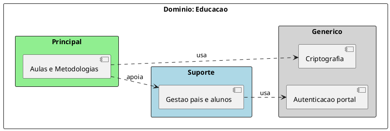

# Exemplos — `ddd-design-estrategico`

## Caso: Escola Primária

### Entrada (resumo)

Negócio educacional: ensina conteúdos e desenvolve habilidades para a vida.
Diferencial: metodologia e qualidade das aulas. Também mantém cadastro de
pais/alunos, portal, autenticação e criptografia de dados.

### Domínio

**Educação** — educação de crianças e adolescentes via ensino de conteúdos e
desenvolvimento de habilidades aplicáveis ao longo da vida.

### Classificação

| Subdomínio | Tipo | Justificativa |
| --- | --- | --- |
| Aulas e Metodologias | Principal | Diferencia a escola no mercado |
| Gestão de dados de pais e alunos | Suporte | CRUD operacional; apoia o ensino sem ser o diferencial |
| Criptografia de dados | Genérico | Capacidade comum de mercado; não diferencia o produto |
| Autenticação do portal | Genérico | Comum a qualquer portal (contexto: escola) |

### Trecho de mapa PlantUML

### Domain Experts (papéis)

| Área | Papel |
| --- | --- |
| Aulas e Metodologias | Coordenação pedagógica / professores |
| Gestão pais e alunos | Secretaria / administração |
| Criptografia / auth | Segurança da informação (ou TI) |

---

## Mini-casos de transferência (mesmo tipo, negócios distintos)

| Negócio | Principal | Suporte (ex.) | Genérico (ex.) |
| --- | --- | --- | --- |
| Netflix | Vídeos | Cadastro de filmes/séries | Faturamento |
| Azul | Voos | Cadastro de pessoas no portal | Autenticação |
| DHL | Serviços logísticos | Integração com outros sistemas logísticos | Contabilidade |

Usar para calibrar: o **tipo** muda com o contexto de mercado, não com o nome
do módulo técnico.
