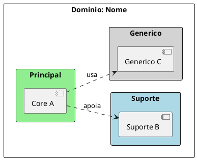
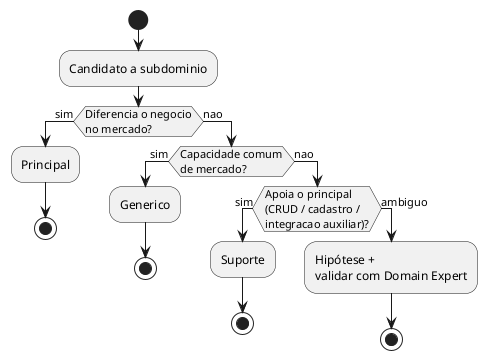
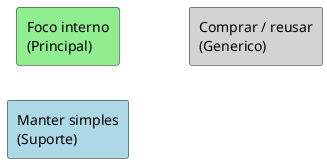

> Preâmbulo compartilhado: [plantuml-preamble.md](../../../references/plantuml-preamble.md)

# Convenções PlantUML — Design Estratégico DDD

Validar com MCP **`user-plantuml`**: `check_syntax` → corrigir → (opcional)
`render_diagram`. Não usar `https://www.plantuml.com/plantuml`.

---

## Comum

```plantuml
@startuml nome-unico-kebab
skinparam shadowing false
' ...
@enduml
```

- Um diagrama por bloco fenced ` ```plantuml `
- Nome do `@startuml` único no arquivo
- Preferir ASCII nos labels se acentos gerarem warning no MCP
- Sem PII, credenciais ou dados sensíveis

---

## Mapa domínio → subdomínios

Cores fixas por tipo:

| Tipo | Cor PlantUML |
| --- | --- |
| Principal | `#LightGreen` |
| Suporte | `#LightBlue` |
| Genérico | `#LightGray` |



- `left to right direction`
- Relacionamentos só quando úteis (`apoia`, `usa`, `alimenta`)
- Não misturar componentes técnicos (API, DB) neste mapa

---

## Fluxograma de classificação (activity)



Ordem das perguntas é **obrigatória** (Principal → Genérico → Suporte →
ambíguo).

---

## Opcional: visão por investimento

Só se o usuário pedir priorização (buy/build/focus):


