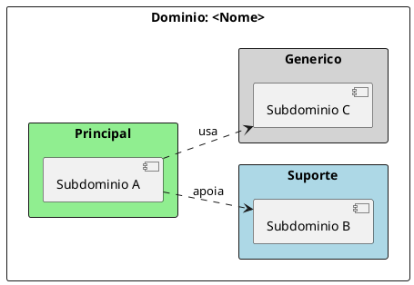
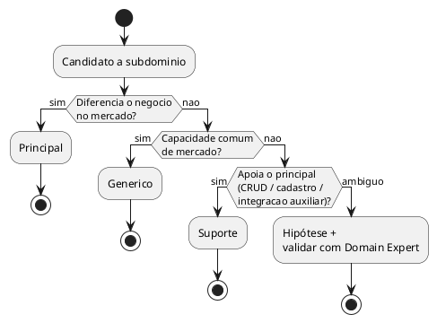

# Design Estratégico — <Nome do negócio / feature>

> Gerado com a skill `ddd-design-estrategico`. Validar classificações com Domain Experts.

## Sumário

| Campo | Valor |
| --- | --- |
| Domínio | <uma frase> |
| Escopo desta análise | <o que entra / o que fica de fora> |
| Data | YYYY-MM-DD |
| Fontes | <narrativa, discovery, C4, backlog…> |

---

## 1. Por que Design Estratégico aqui

2–4 bullets: o que se quer alinhar (língua do negócio, priorização, fronteiras
de solução). Sem jargão de framework além do necessário.

---

## 2. Domínio

**Definição:** <frase>

**Dentro do escopo**

- …

**Fora do escopo (nesta análise)**

- …

---

## 3. Subdomínios

### 3.1 Mapa (PlantUML)

### 3.2 Inventário classificado

| Subdomínio | Tipo | Justificativa | Evidência | Domain Expert |
| --- | --- | --- | --- | --- |
| … | Principal / Suporte / Genérico | … | Fato / Hipótese | papel |

### 3.3 Detalhe por subdomínio

#### <Nome> — Principal | Suporte | Genérico

- **Responsabilidade:** …
- **Por que este tipo:** …
- **Dependências / relações:** …
- **O que não é:** …

(Repetir para cada subdomínio.)

---

## 4. Fluxograma de classificação (referência)

---

## 5. Domain Experts

| Área / subdomínio | Papel do expert | Status |
| --- | --- | --- |
| … | … | Identificado / A identificar |

---

## 6. Implicações para a solução (opcional)

Bullets curtos — priorização de investimento, buy vs build em genéricos,
fronteiras candidatas a bounded context. **Não** detalhar tático DDD aqui.

---

## 7. Hipóteses e abertos

- [ ] …
- [ ] …

## 8. Referências

- Evans, E. *Domain-Driven Design* (2003)
- Vernon, V. *Implementing Domain-Driven Design* (2013)
- Khononov, V. *Learning Domain-Driven Design* (2021)
- Fluxograma de identificação: https://vladikk.com/2018/01/26/revisiting-the-basics-of-ddd/
