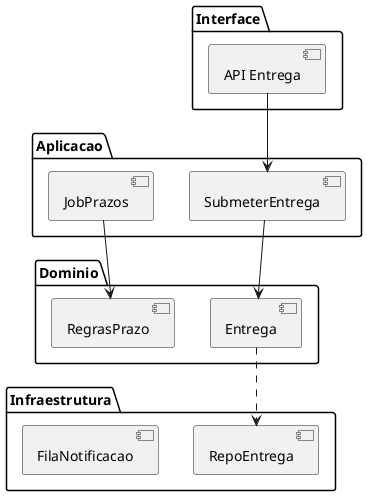

# Exemplos — `ddd-design-tatico`

## BC Entrega de Atividades (escola)

### Camadas (resumo)

| Camada | Exemplo |
| --- | --- |
| Interface | API de entrega; tela do aluno |
| Aplicação | Caso de uso “submeter entrega”; job de notificação de prazo |
| Domínio | Regras de prazo, status da entrega, cálculo de atraso |
| Infra | Persistência da entrega; fila de notificação |

### Domínio — notas (aula)

Lógica de notas (desconto por atraso) e planos de aula vivem na **camada de
domínio** — não na aplicação.

### Agregado sugerido

- **Raiz:** Entrega  
- **VOs:** StatusEntrega, Prazo, Anexo  
- **Invariante:** não aceitar entrega após prazo fechado sem política explícita

### PlantUML camadas

