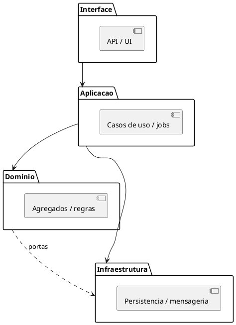
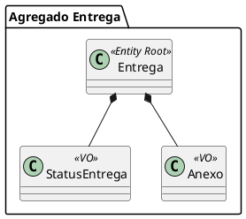

# Design Tático — <BC / recorte>

> Gerado com `ddd-design-tatico`.

## Sumário

| Campo | Valor |
| --- | --- |
| Bounded Context | … |
| Data | YYYY-MM-DD |
| Fontes | ES, UL, stories… |

---

## 1. Camadas

| Camada | Conteúdo neste BC |
| --- | --- |
| Interface | … |
| Aplicação | … (gatilhos / casos de uso sem regra) |
| Domínio | … |
| Infraestrutura | … |

---

## 2. Blocos de construção

### Agregados

| Raiz | Membros | Invariantes |
| --- | --- | --- |
| … | … | … |

### Entidades

| Nome | Identidade | Notas |
| --- | --- | --- |
| … | … | … |

### Value Objects

| Nome | Atributos | Notas |
| --- | --- | --- |
| … | … | … |

---

## 3. PlantUML — camadas

## 4. PlantUML — agregados

---

## 5. Decisões tecnológicas (hipóteses)

| Tema | Hipótese | Abrir spike? |
| --- | --- | --- |
| Persistência | … | … |

## 6. Abertos

- [ ] …
