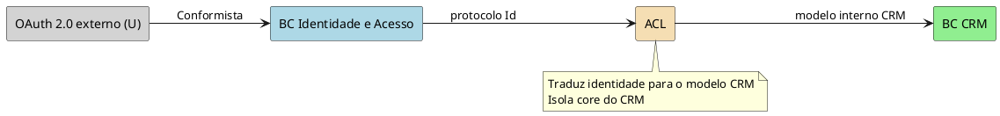

# Exemplos — `ddd-integracao-contextos`

## Escola / identidade: OAuth externo + ACL no CRM

### Contexto

Serviço terceiro OAuth 2.0 (provedor global). A escola cria BC de **Identidade e
Acesso** e precisa expor autenticação aos BCs internos. O CRM (Times 1 e 2) não
aceita o protocolo do Time 3 (Identidade); Identidade não muda o protocolo →
**não-conformismo** → ACL no lado do CRM.

### Relações

| U | D | Padrão |
| --- | --- | --- |
| Provedor OAuth | BC Identidade e Acesso | Conformista |
| BC Identidade e Acesso | BC CRM (via ACL) | ACL |

### Por que ACL no CRM

- CRM toca processos centrais de relacionamento (risco de corromper modelo).
- Protocolo de Identidade não serve ao modelo do CRM.
- Isola mudanças futuras do provedor/protocolo de Id.

### PlantUML

