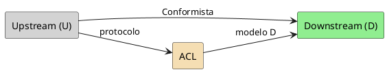

# Convenções PlantUML — Integração de Contextos

Validar com MCP **`user-plantuml`**: `check_syntax` → corrigir.

## Mapa U → D

| Elemento | Cor sugerida |
| --- | --- |
| Fornecedor externo / U | `#LightGray` |
| BC interno | `#LightBlue` ou `#LightGreen` |
| ACL | `#Wheat` |

- Rótulo da seta = padrão (`Conformista`, `ACL`, `Customer-Supplier`)
- Preferir ASCII nos labels se acentos gerarem warning
- Sem PII
