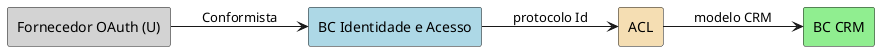

# Integração de Contextos — <feature>

> Gerado com `ddd-integracao-contextos`. Validar com os times donos dos BCs.

## Sumário

| Campo | Valor |
| --- | --- |
| Feature / sistema | … |
| Fontes | BCs, stories, notas… |
| Data | YYYY-MM-DD |

---

## 1. Contextos envolvidos

| BC | Time dono | Papel típico (U/D) |
| --- | --- | --- |
| … | … | … |

---

## 2. Relações

| Upstream (U) | Downstream (D) | Padrão | Justificativa |
| --- | --- | --- | --- |
| … | … | Conformista / ACL / … | … |

### Detalhe — \<U\> → \<D\>

- **Protocolo / modelo em jogo:** …
- **Quem manda:** …
- **Padrão escolhido:** …
- **ACL (se houver):** o que traduz; o que isola; risco se não houver

---

## 3. PlantUML — mapa de integração

---

## 4. Critérios ACL aplicados

| Critério | Aplica? | Evidência |
| --- | --- | --- |
| D contém subdomínio principal | Sim/Não | … |
| Modelo U inadequado / legado | Sim/Não | … |
| Protocolo U instável | Sim/Não | … |

---

## 5. Abertos

- [ ] …
