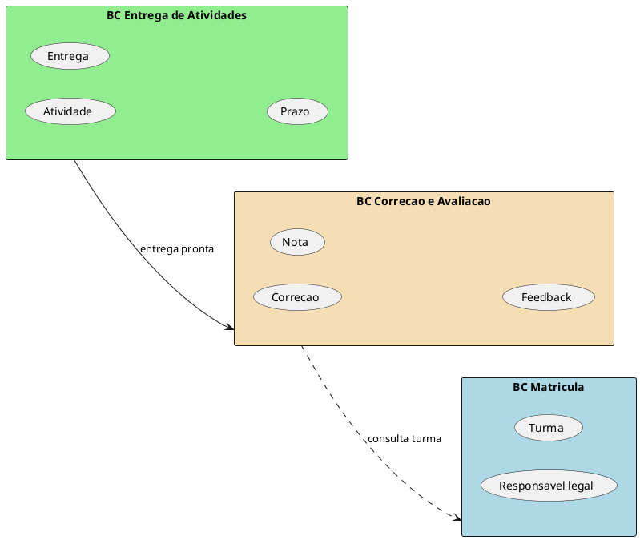
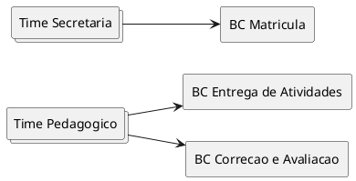

# Exemplos — `ddd-linguagem-e-contextos`

## Caso: Escola — entregas de atividades e correções

### Recorte

Não modelar a escola inteira. Foco: **entrega de atividades** e **correção**.

### Desafio (resumo)

Professores publicam atividades; alunos entregam; correção gera feedback/nota.
Dores típicas: prazos, o que conta como “entregue”, quem vê o quê (pais vs
aluno vs professor).

### Linguagem — conflito “pais”

O mesmo rótulo muda por área:

| Área | Como “pais” aparece | Termo ubíquo proposto |
| --- | --- | --- |
| Admissão | Família em processo de escolha da escola | Responsavel em admissao / Prospect |
| Marketing | Público-alvo da campanha | Lead familiar |
| Secretaria | Contato oficial do aluno matriculado | Responsavel legal |
| Entregas/correções | Quem acompanha nota/prazo do aluno | Responsavel pedagogico |

Regra: **não** usar só “pais” no modelo sem qualificador de contexto.

### Ambíguo — “política”

| Significado | Termo ubíquo |
| --- | --- |
| Lei / norma externa | Politica regulatoria |
| Regra interna da escola | Politica interna (ou Regra escolar) |

### Sinônimo — “login”

| Uso coloquial | Termo ubíquo |
| --- | --- |
| Ato de autenticar | Autenticacao |
| Conta do usuário | Conta de acesso |

### Bounded Contexts (proposta ilustrativa)

| BC | Linguagem-núcleo | Time dono |
| --- | --- | --- |
| Entrega de Atividades | Atividade, Prazo, Entrega, Status da entrega | Time Pedagógico |
| Correcao e Avaliacao | Correcao, Feedback, Nota, Rubrica | Time Pedagógico |
| Matricula / Turmas | Ficha, Turma, Responsavel legal | Time Secretaria |

Obs.: dois BCs com o **mesmo** time dono é válido; compartilhar **um** BC entre
dois times **não** é.

### PlantUML (válido)

