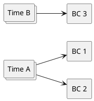
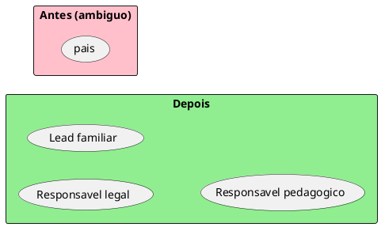

> Preâmbulo compartilhado: [plantuml-preamble.md](../../../references/plantuml-preamble.md)

# Convenções PlantUML — Linguagem e Contextos

Validar com MCP **`user-plantuml`**: `check_syntax` → corrigir → (opcional)
`render_diagram`. Não usar `https://www.plantuml.com/plantuml`.

---

## Comum

```plantuml
@startuml nome-unico-kebab
skinparam shadowing false
left to right direction
@enduml
```

- Preferir ASCII nos labels se acentos gerarem warning
- Sem PII; usar papéis de time

---

## Mapa de Bounded Contexts

- Um `rectangle` por BC
- Termos-núcleo como ovals `(Termo)` **dentro** do BC
- Relação entre BCs: seta tracejada ou sólida com rótulo curto (`consulta`,
  `publica evento`, `anti-corruption` só se o usuário pedir padrão de integração)

Cores sugeridas (opcional, só para legibilidade):

| Uso | Cor |
| --- | --- |
| BC em foco no recorte | `#LightGreen` |
| BC relacionado | `#LightBlue` |
| BC de avaliação / outro | `#Wheat` |

---

## Times × BCs



Regras visuais:

- Cada BC tem **exatamente um** time apontando para ele como dono
- Um time pode apontar para **vários** BCs
- Não desenhar dois times donos do mesmo BC

---

## Opcional: termo ambíguo (antes/depois)

Só se ajudar a explicar resolução de UL:


