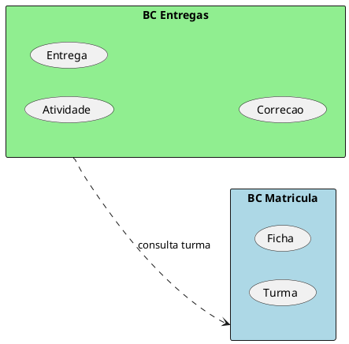
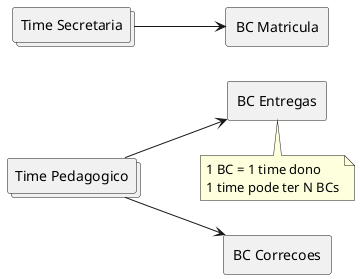

# Conhecimento DDD — <feature / recorte>

> Gerado com `ddd-linguagem-e-contextos`. Validar com Domain Experts.
> Subdomínio ≠ Bounded Context.

## Sumário

| Campo | Valor |
| --- | --- |
| Recorte | … |
| Domínio (se conhecido) | … |
| Data | YYYY-MM-DD |
| Fontes | design estratégico, stories, notas… |

### Índice do catálogo

| Seção | Path / link |
| --- | --- |
| Desafio do negócio | (esta seção ou `desafio-negocio.md`) |
| Linguagem ubíqua | (esta seção ou `linguagem-ubiqua.md`) |
| Bounded Contexts | (esta seção ou `bounded-contexts.md`) |
| Cenários | `cenarios/` / Domain Stories |
| Código | … |
| Gestão do projeto | … |
| Times | … |

---

## 1. Desafio do negócio

### O que o negócio faz (neste recorte)

…

### Processos-chave

- …

### Dores / desafios conhecidos (visão do Domain Expert)

- …

### Realidade vs desejo

| Aspecto | Realidade (as-is) | Desejo (to-be) |
| --- | --- | --- |
| … | … | … |

### Domain Experts

| Área | Papel |
| --- | --- |
| … | … |

---

## 2. Linguagem ubíqua (dicionário)

| Termo | Definição neste contexto | BC / área | Ambíguo? | Sinônimos evitados | Evidência |
| --- | --- | --- | --- | --- | --- |
| … | … | … | Não / Sim → ver nota | … | Fato / Hipótese |

### Conflitos resolvidos

- **\<termo\>:** significados distintos → \<TermoA\> vs \<TermoB\> …

### Conflitos abertos

- [ ] …

---

## 3. Bounded Contexts

| BC | Linguagem-núcleo | Processos | Subdomínios relacionados | Time dono |
| --- | --- | --- | --- | --- |
| … | … | … | … | … |

### Detalhe — \<Nome do BC\>

- **Por que este limite:** (linguagem / processos)
- **Dentro:** …
- **Fora:** …
- **Integra com:** …

---

## 4. Diagramas PlantUML

### Mapa de contextos

### Times × Bounded Contexts

---

## 5. Hipóteses e abertos

- [ ] …
- [ ] …

## 6. Referências internas

- Design estratégico: …
- Domain Stories: …
- Evans / Vernon / Khononov (DDD) — Bounded Context & Ubiquitous Language
