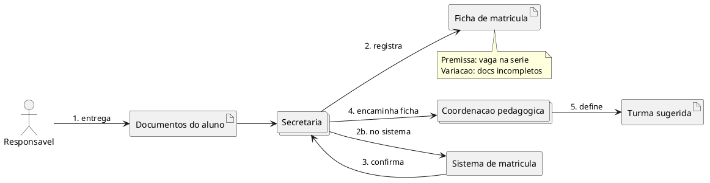

# Exemplos — `domain-storytelling`

## Caso: Escola — matrícula de aluno (as-is, granularidade média, digitalizado parcial)

### Entrada (resumo)

No “Projeto Escola”, a secretaria recebe o responsável, preenche ficha de
matrícula e encaminha dados para a coordenação pedagógica organizar a turma.

### Escopo

| Eixo | Escolha |
| --- | --- |
| Granularidade | Média |
| Momento | As-is |
| Pureza | Digitalizado (há sistema de matrícula) |

**Limites:** não cobre rematrícula, transferências nem pagamento de mensalidade.

### Atores

| Ator | Tipo |
| --- | --- |
| Responsável | Pessoa |
| Secretaria | Grupo |
| Coordenação pedagógica | Grupo |
| Sistema de matrícula | Sistema |

### Objetos de trabalho

| Objeto | Tipo |
| --- | --- |
| Documentos do aluno | Físico / digital |
| Ficha de matrícula | Documento |
| Turma sugerida | Informação |

### História

1. **Responsável** entrega **documentos do aluno** para a **Secretaria**.
2. **Secretaria** registra **ficha de matrícula** no **Sistema de matrícula**.
3. **Sistema de matrícula** confirma **ficha de matrícula** para a **Secretaria**.
4. **Secretaria** encaminha **ficha de matrícula** para a **Coordenação pedagógica**.
5. **Coordenação pedagógica** define **turma sugerida** a partir da **ficha de matrícula**.

**Premissa:** vaga disponível na série pretendida.  
**Variação:** se documentos incompletos → anotar e interromper no passo 2.

### PlantUML

### Glossário

| Termo | Significado |
| --- | --- |
| Ficha de matrícula | Registro oficial do vínculo aluno–escola naquele ano |
| Turma sugerida | Alocação preliminar antes da confirmação final |

---

## Dica de modelagem multi-departamento

Departamentos da escola (secretaria, coordenação, financeiro…) têm **histórias
próprias** que se encaixam numa história maior (“Projeto Escola”).

- Uma MD por cenário/departamento quando o escopo diverge.
- README índice com: cenário | escopo | atores-chave | link.
- Conflito de termo entre departamentos → entrada no glossário + aberto.
