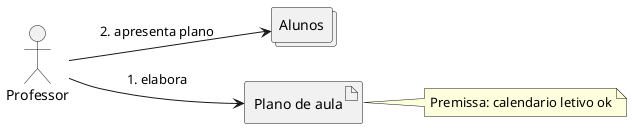
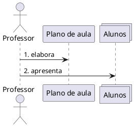
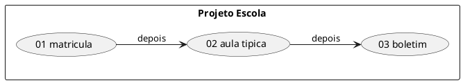

# Convenções PlantUML — Domain Storytelling

Validar com MCP **`user-plantuml`**: `check_syntax` → corrigir → (opcional)
`render_diagram`. Não usar `https://www.plantuml.com/plantuml`.

---

## Comum

```plantuml
@startuml story-nome-kebab
skinparam shadowing false
left to right direction
' ...
@enduml
```

- Um diagrama por bloco ` ```plantuml `
- Preferir ASCII nos labels se acentos gerarem warning
- Sem PII (usar papéis: `Responsavel`, não nome completo)

---

## Mapeamento pictográfico → PlantUML

| Elemento DST | PlantUML sugerido |
| --- | --- |
| Ator pessoa | `actor "Papel" as X` |
| Ator grupo | `collections "Papel" as X` |
| Ator sistema | `rectangle "Sistema" as X` |
| Objeto de trabalho | `artifact "Termo" as Y` |
| Atividade | seta com rótulo `N. verbo` |
| Anotação | `note left/right/bottom of …` |

Frase: **Ator → Objeto** ou **Ator → Ator** com verbo numerado.

---

## Exemplo mínimo



---

## Sequência alternativa (quando o mapa fica denso)

Se houver muitos passos, complementar (não substituir) com sequence:



Manter os **mesmos números** da lista de frases do MD.

---

## README índice (várias histórias)


