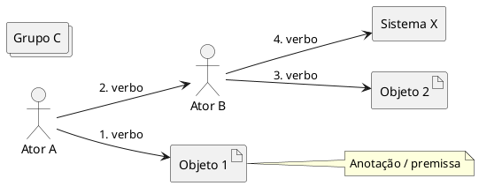

# Domain Story — <título do cenário>

> Gerado com a skill `domain-storytelling`. Validar com Domain Experts.

## Sumário

| Campo | Valor |
| --- | --- |
| Domínio / subdomínio | … |
| Cenário | … (exemplo concreto) |
| Granularidade | Grossa / Média / Fina |
| Momento | As-is / To-be |
| Pureza | Puro / Digitalizado |
| Data | YYYY-MM-DD |
| Fontes | narrativa, workshop, notas… |

**Limites desta história:** o que **não** cobre.

---

## 1. Escopo

Justificar em 2–4 bullets por que este recorte (granularidade / momento /
pureza) serve ao objetivo atual (entender domínio, requisitos, fronteiras…).

---

## 2. Atores

| Ator (papel) | Tipo | Notas |
| --- | --- | --- |
| … | Pessoa / Grupo / Sistema | … |

---

## 3. Objetos de trabalho

| Objeto | Tipo (físico / doc / digital / info) | Notas |
| --- | --- | --- |
| … | … | … |

---

## 4. História (frases numeradas)

1. **\<Ator\>** \<verbo\> **\<objeto\>** \[para/com **\<Ator\>**\].
2. …
3. …

### Premissas

- …

### Anotações / variações

- No passo N: se … então … (ou ver cenário `NN-…`)
- …

---

## 5. Diagrama PlantUML

---

## 6. Glossário (linguagem ubíqua)

| Termo | Significado neste domínio |
| --- | --- |
| … | … |

---

## 7. Equipe / validação

| Papel | Quem (papel org., sem PII desnecessária) | Status |
| --- | --- | --- |
| Contador | … | … |
| Modelador | … | … |
| Validador | … | Pendente / Ok |

---

## 8. Hipóteses e abertos

- [ ] …
- [ ] …

## 9. Relação com outras histórias

| História | Relação |
| --- | --- |
| `01-…` | antecede / continua / variação de |
