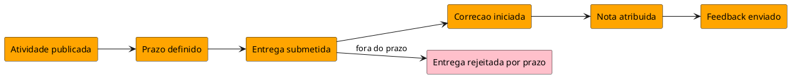

# Exemplos — `event-storming`

## Escola — entrega e correção de atividade

### Brainstorm (amostra)

- Atividade publicada
- Prazo definido
- Entrega submetida
- Entrega recebida
- Correcao iniciada
- Nota atribuida
- Feedback enviado
- Entrega rejeitada por prazo
- Entrega reaberta

### Timeline ideal

1. Atividade publicada  
2. Prazo definido  
3. Entrega submetida  
4. Correcao iniciada  
5. Nota atribuida  
6. Feedback enviado  

### Alternativa

Após “Entrega submetida”: se fora do prazo → “Entrega rejeitada por prazo”.

### PlantUML

