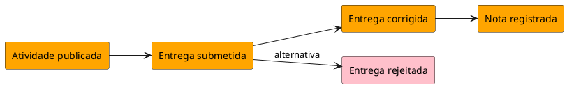

# Event Storming — <cenário>

> Gerado com `event-storming`.

## Sumário

| Campo | Valor |
| --- | --- |
| Recorte / BC | … |
| Tipo | Brainstorm + timeline |
| Data | YYYY-MM-DD |
| Facilitador / Experts | papéis |

---

## 1. Participantes

| Papel | Quem (papel org.) |
| --- | --- |
| Domain Expert | … |
| Ouvinte | … |
| Facilitador | … |

---

## 2. Brainstorm — eventos (sem ordem)

- Atividade publicada
- …
- …

*(verbo no passado)*

---

## 3. Timeline — caminho ideal

1. …
2. …
3. …

## 4. Alternativas / exceções

| Após evento | Alternativa | Evento(s) |
| --- | --- | --- |
| … | … | … |

---

## 5. PlantUML — linha do tempo

---

## 6. Próximos passos

- [ ] `event-storming-to-scenario-tables` (comandos/políticas/tabelas)
- [ ] `ddd-design-tatico` (agregados)
- [ ] Abertos: …
