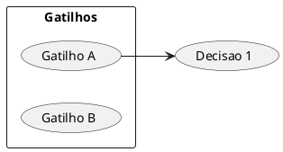
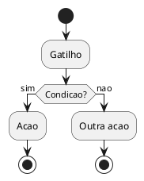
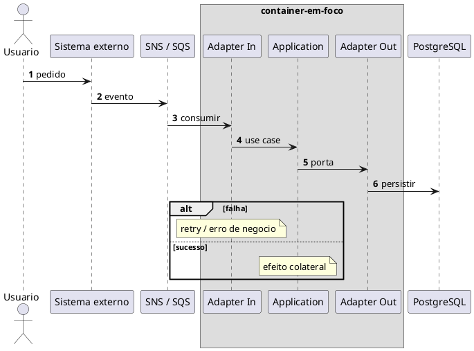

> Preâmbulo compartilhado: [plantuml-preamble.md](../../../references/plantuml-preamble.md)

# Convenções PlantUML — fluxogramas-decisao (as-is)

Alinhado aos MDs em `products/*/01-product/03-discovery/00-as-is/`.

Validar com MCP **`user-plantuml`**: `check_syntax` → corrigir → (opcional) `render_diagram`.
Não usar `https://www.plantuml.com/plantuml`.

---

## Comum a todos os diagramas

```plantuml
@startuml nome-unico-kebab
skinparam shadowing false
' ...
@enduml
```

- Um diagrama por bloco fenced ` ```plantuml `
- Nome do `@startuml` único no arquivo (ex.: `nova-assinatura`, `seq-nova-assinatura`)
- Sem PII, credenciais ou payloads sensíveis nos labels
- Preferir ASCII nos labels se acentos/quebra de linha gerarem warning no MCP

---

## Mapa (README)



- `left to right direction`
- Gatilhos dentro de `rectangle "Gatilhos"`
- Decisões como ovals `(...)`; setas gatilho → decisão (e entre decisões se houver ordem)

---

## Fluxograma de decisão (activity)



| Elemento | Uso |
| --- | --- |
| `start` / `stop` | Entrada e fim de ramo |
| `:acao;` | Passo / efeito |
| `if (...) then (rotulo)` | Pergunta de negócio (sim/não ou ramos nomeados) |
| `elseif` / `else` | Ramos alternativos |
| `while (...) is (sim)` … `endwhile` | Loop sobre coleção |
| `\n` no texto | Quebra de linha no losango/ação |

**Conteúdo:** só decisões e efeitos de negócio — não detalhar cada chamada HTTP (isso é da sequência).

---

## Diagrama de sequência



| Regra | Detalhe |
| --- | --- |
| `autonumber` | Sempre |
| `box` | Só o container cujo interior importa |
| Fora do box | Outros containers + software systems |
| Mensagens | Intenção de negócio (`processCompanies`, `REB0 include`) |
| `alt` / `opt` / `loop` | Só ramos que mudam a regra |
| `Note over` | Silêncios importantes (“nao alerta”, “flag off”) |

Nomes de participantes = nomes do C4 da feature (Containers + component view citada no MD).

---

## Anti-padrões

- Mermaid no lugar de PlantUML nesta pasta
- Sequência sem `box` quando há componentes internos documentados no C4
- Activity que só repete a sequência passo a passo sem ramificar
- Inventar participantes que não existem no C4/código
- Um único MD gigante com todos os fluxos do domínio (preferir N arquivos + README)
- Inventar path fora de hub-paths (as-is só em `03-discovery/00-as-is/`)
