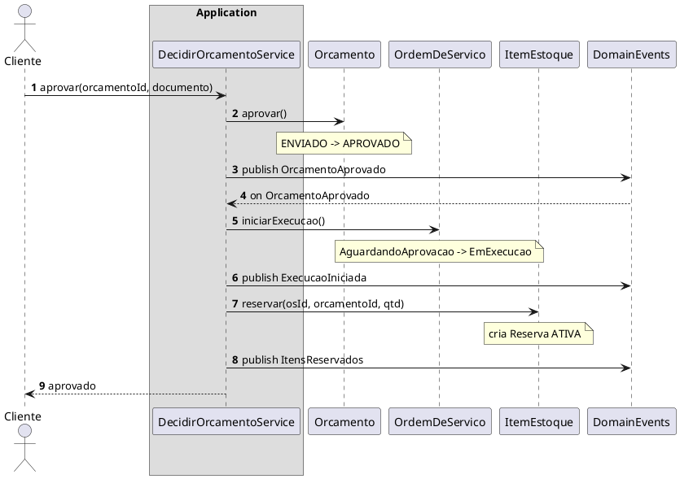
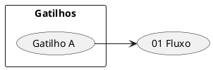

# Convenções PlantUML — fluxos entregáveis

Validar com MCP **`user-plantuml`**: `check_syntax` → corrigir.
Não usar plantuml.com.

---

## Comum

```plantuml
@startuml nome-unico-kebab
skinparam shadowing false
' ...
@enduml
```

- Um diagrama por bloco ` ```plantuml `
- Preferir ASCII em labels se acentos gerarem warning
- `autonumber` em toda sequência

---

## Sequência — participantes



| Elemento | Uso |
| --- | --- |
| `box "Application"` | Só services de orquestração |
| Agregados fora do box | Fronteira de BC / domínio |
| `DomainEvents` / `Events` | **Obrigatório** — publish e on |
| `note over X : A -> B` | Troca de status (obrigatória quando houver) |
| `note over X : status inalterado: S` | Quando o fluxo não muda status |
| `publish Evento` / `on Evento` | Produção / consumo |
| `alt` / `else` | Só no diagrama de alternativos (ou ramos que mudam regra) |

---

## Status

- Sempre `De -> Para` no note (ou mensagem de retorno com o status novo).
- Incluir status de **todos** os agregados afetados no mesmo diagrama
  (ex.: Orcamento **e** OS).
- Status de entidade interna (ex. `Reserva ATIVA -> CONSUMIDA`) também conta.

---

## Eventos

- Nome no passado; preferir linguagem do Event Storming.
- `App -> Ev : publish X` = produção.
- `Ev --> App : on X` = consumo neste fluxo (reação síncrona ok no monolito).
- Se o consumidor for **outro** fluxo:  
  `note over Ev : X consumido em: 05 - Aguardando item`
- Sem evento de domínio:  
  `note over Ev : sem publish neste fluxo`  
  e linha correspondente na tabela Eventos do MD.

Não inventar Event Bus / SNS/SQS se o design for monolito in-process —
`DomainEvents` representa o **contrato lógico**.

---

## Mapa (README)



---

## Anti-padrões

- Sequência sem participante `DomainEvents` e sem nota explicando ausência
- `save` sem note de status quando o método de domínio muda status
- Evento no infinitivo (`AprovarOrcamento`) — usar passado (`OrcamentoAprovado`)
- Mermaid no lugar de PlantUML nesta pasta
