# Requisitos — <produto / feature>

> Gerado com `levantamento-requisitos`. Upstream — validar antes do build.

## Sumário

| Campo | Valor |
| --- | --- |
| Produto / feature | … |
| Data | YYYY-MM-DD |
| Stakeholders | … |

---

## 1. Riscos (Cagan)

| Risco | Status | Evidência / pergunta em aberto |
| --- | --- | --- |
| Valor | … | … |
| Negócio | … | … |
| Usabilidade | … | … |
| Técnico | … | … |

---

## 2. Persona

- **Quem:** …
- **Contexto:** …
- **Motivação:** …

## 3. Problema

…

## 4. Objetivos da solução

- …

## 5. Jornada do usuário

1. …
2. …
3. …

```plantuml
@startuml jornada-<slug>
skinparam shadowing false
left to right direction

rectangle "Passo 1" as S1
rectangle "Passo 2" as S2
rectangle "Passo 3" as S3
S1 --> S2
S2 --> S3
@enduml
```

---

## 6. Requisitos funcionais

| ID | Requisito | Prioridade |
| --- | --- | --- |
| RF-01 | … | … |

## 7. Requisitos não funcionais

| ID | Categoria | Requisito |
| --- | --- | --- |
| RNF-01 | Segurança / Perf / … | … |

---

## 8. Abertos

- [ ] …

## 9. Próximo passo

`task-refinement` (e, se necessário, `ddd-design-tatico`).
