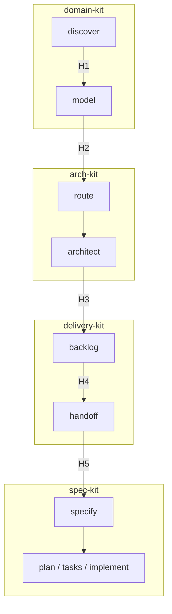

# Handoffs entre domain-kit, arch-kit, delivery-kit e spec-kit

Design de contratos entre os três kits lógicos.  
**Fixture:** produto `oficina-mecanica`, iniciativa `tech-challenge-fase1`.  
**Regra:** IDs estáveis (`D-n`, `fluxo-NN`, `story-NN`, `spec-NNN`) — não paths de pasta.

---

## Visão geral



| Handoff | De → Para | Artefato âncora |
| --- | --- | --- |
| **H1** | discover → model | `01-product/03-discovery/` completo |
| **H2** | model → arch | BCs + design tático + fluxos por capability |
| **H3** | arch → delivery | estilo + HLD/C4 + ADRs + contratos eventos |
| **H4** | backlog → handoff | Tech Story #NN pronta (DoR) |
| **H5** | handoff → spec-kit | `hub-evidence.yml` + stub `spec.md` |

---

## IDs estáveis (contrato entre kits)

| ID | Formato | Exemplo oficina | Dono |
| --- | --- | --- | --- |
| Decisão produto | `D-{nn}` | D-16 Orçamento não chama Estoque | domain-kit → registry |
| Decisão plataforma | `D-{nn}` | D-35 Java/Spring/SQLite | arch-kit → registry |
| Capability | slug kebab | `ordem-de-servico` | domain-kit |
| Fluxo entregável | `fluxo-{NN}` | fluxo-01 identificação e abertura OS | domain-kit |
| Tech Story | `story-{NN}` | story-11 Fluxo 01 | delivery-kit |
| Spec feature | `spec-{NNN}` | spec-011 | spec-kit |

**Registry** (`03-registry/produto.md`, `plataforma.md`) é índice — não duplicar texto longo dos artefatos.

---

## H1 — discover → model (domain-kit interno)

### Quando

Event Storming, Domain Stories ou cenários suficientes para definir BCs e linguagem ubíqua.

### Gate G1 — Pronto para modelar

| # | Critério | Evidência oficina |
| --- | --- | --- |
| G1.1 | Desafio de negócio articulado | `01-product/02-domain/desafio-negocio.md` |
| G1.2 | Pelo menos 1 artefato de discovery | `01-product/03-discovery/01-event-storming/` |
| G1.3 | Subdomínios classificados (estratégico) | `01-product/01-vision/01-design-estrategico.md` |

### Artefatos entregues

```yaml
handoff: H1
from: domain.discover
to: domain.model
outputs:
  - path: products/{produto}/01-product/01-vision/01-design-estrategico.md
    status: draft | ready
  - path: products/{produto}/01-product/03-discovery/
    status: ready
  - path: products/{produto}/01-product/02-domain/
    status: partial | ready
registry_updates: []  # raro nesta fase
```

### Checklist para `/domain.model`

- [ ] Termos ambíguos listados em abertos (não inventar UL)
- [ ] BCs candidatos nomeados; integração ainda pode ser rascunho
- [ ] Nenhum design tático ainda (isso é model)

---

## H2 — model → arch (domain-kit → arch-kit)

### Quando

BCs fechados, design tático por capability crítica, fluxos entregáveis mapeados.

### Gate G2 — Pronto para arquitetura

| # | Critério | Evidência oficina |
| --- | --- | --- |
| G2.1 | Catálogo de BCs | `01-product/02-domain/bounded-contexts.md` |
| G2.2 | Integração / ACL | `01-product/04-integration/01-contextos.md` |
| G2.3 | Design tático **por BC do MVP** | `02-capabilities/{bc}/design-tatico.md` (5 BCs) |
| G2.4 | Fluxos entregáveis numerados | `02-capabilities/{bc}/fluxos/01-…07-….md` |
| G2.5 | Requisitos RF/RNF resumidos | `04-platform/01-non-functional/01-requisitos.md` |
| G2.6 | Decisões D-01…D-33 registradas | `03-registry/produto.md` |

### Artefatos entregues

```yaml
handoff: H2
from: domain.model
to: arch.route
outputs:
  capabilities:
    - ordem-de-servico
    - orcamento
    - estoque
    - cadastros
    - acesso
  fluxos_total: 7
  registry_produto: products/oficina-mecanica/03-registry/produto.md
  requisitos: products/oficina-mecanica/04-platform/01-non-functional/01-requisitos.md
blockers: []  # ex.: "BC estoque sem agregado definido"
```

### O que arch-kit **não** precisa receber de novo

- Event Storming bruto (linkar se necessário)
- Domain Stories (linkar)
- Fluxogramas as-is (só se legado)

### Checklist para `/arch.route`

- [ ] Rodar diagnóstico de estágio → `rota-decisao.md`
- [ ] Não escolher stack antes de estilo (D-22 antes de D-35)
- [ ] RFC se decisão ainda em discussão; ADR só após consenso

**Oficina (estado 2026-08-23):** G2 passou → `rota-decisao.md` apontou estágio 8→9.

---

## H3 — arch → delivery (arch-kit → delivery-kit)

### Quando

Estilo, stack, HLD/LLD, C4 mínimo (C1–C2), ADRs das decisões estruturais, contratos de eventos.

### Gate G3 — Pronto para backlog

| # | Critério | Evidência oficina |
| --- | --- | --- |
| G3.1 | Estilo documentado | `04-platform/03-architecture/estilo.md` (Clean, D-34) |
| G3.2 | ADR estilo + stack | `04-adr/0001-…`, `0002-…` status Aceito |
| G3.3 | HLD + LLD | `hld.md`, `lld.md` |
| G3.4 | C4 C1 + C2 (C3 por BC conforme story) | `c4/01-contexto.md`, `02-conteineres.md` |
| G3.5 | Database design | `04-platform/02-data/01-database-design.md` |
| G3.6 | Contratos eventos | `03-architecture/02-contratos-eventos.md` |
| G3.7 | Constitution derivada | `04-platform/05-constitution.md` |
| G3.8 | Registry plataforma | `03-registry/plataforma.md` (D-34…D-36) |

**Opcional (não bloqueia MVP):** DAS, C3 completo, Landscape.

### Artefatos entregues

```yaml
handoff: H3
from: arch.architect
to: delivery.backlog
outputs:
  estilo: products/oficina-mecanica/04-platform/03-architecture/estilo.md
  adrs:
    - 0001-monolito-clean-camadas-por-bc
    - 0002-stack-java-spring-sqlite
  packaging: D-20  # pacotes por BC
  repo_target: repos/oficina-backend
  constitution: products/oficina-mecanica/04-platform/05-constitution.md
enunciado: initiatives/tech-challenge-fase1/01-enunciado.md
```

### Checklist para `/delivery.backlog`

- [ ] 1 fluxo entregável = 1 story de orquestração (regra oficina)
- [ ] Domínio BC antes de orquestração (#3–#10 antes de #11–#17)
- [ ] Cross-cutting (#18–#21) após fundação (#1)
- [ ] Cada story referencia D-n, fluxos, contratos eventos

**Oficina:** G3 passou → 21 Tech Stories em `03-backlog/`.

---

## H4 — story pronta → handoff (delivery-kit interno)

### Gate G4 — Definition of Ready (por story)

Aplicar antes de gerar spec-kit para **uma** story.

| # | Critério | Story #11 exemplo |
| --- | --- | --- |
| G4.1 | Objetivo + escopo IN/OUT | `11-fluxo-01-abertura-os.md` |
| G4.2 | Deps resolvidas (#3, #9, #10) | stories 3, 9, 10 existem |
| G4.3 | Evidência hub linkada | fluxo-01, fluxos-aplicacao |
| G4.4 | Critérios de aceite comportamentais | checklist § |
| G4.5 | Eventos produtor/consumidor | `OrdemServicoAberta` |
| G4.6 | spec-NNN reservado | `011-fluxo-01-abertura-os` |

### Matriz story → evidência (padrão)

| Tipo story | Evidência obrigatória |
| --- | --- |
| Bootstrap (#1) | estilo, ADRs, constitution, database_design |
| BC domínio (#3–#10) | design_tatico do BC, database_design |
| Orquestração (#11–#17) | fluxo-NN, fluxos_aplicacao, contratos_eventos, design_tatico dos BCs envolvidos |
| Cross-cutting (#18–#21) | constitution, requisitos RNF, ADR se aplicável |

---

## H5 — handoff → spec-kit (delivery-kit → spec-kit)

### Artefatos gerados no repo de código

Por story, em `repos/oficina-backend/specs/NNN-*/`:

| Arquivo | Origem |
| --- | --- |
| `hub-evidence.yml` | delivery-kit a partir do template hub |
| `spec.md` | espelho dos critérios de aceite da Tech Story |
| (depois) `plan.md`, `tasks.md` | `/speckit.plan`, `/speckit.tasks` |
| (depois) `design-pretask.md` | `/speckit.design pre` |

### Exemplo hub-evidence.yml — story #11

```yaml
spec_id: "011"
backlog_story: 11
backlog: 11-fluxo-01-abertura-os.md
capability: ordem-de-servico
fluxos:
  - products/oficina-mecanica/02-capabilities/ordem-de-servico/fluxos/01-identificacao-e-abertura-os.md
fluxos_aplicacao: products/oficina-mecanica/02-capabilities/ordem-de-servico/fluxos-aplicacao.md
decisoes: [D-19, D-21, D-36]

read_before:
  specify:
    - backlog
    - constitution
    - registry_produto
  plan:
    - backlog
    - constitution
    - registry_produto
    - design_tatico
    - database_design
    - fluxos
    - fluxos_aplicacao
    - contratos_eventos
  tasks:
    - design_tatico
    - contratos_eventos
    - fluxos
    - fluxos_aplicacao
  implement:
    - design_tatico
    - registry_produto
    - contratos_eventos
```

### Gate G5 — Pronto para `/speckit.specify`

| # | Critério |
| --- | --- |
| G5.1 | `hub-evidence.yml` válido + paths resolvem via `.specify/hub-paths.yml` |
| G5.2 | G4 passou para esta story |
| G5.3 | Constitution copiada/sincronizada em `.specify/memory/constitution.md` |
| G5.4 | Branch `NNN-slug` criada (spec-kit) |

### Sequência spec-kit pós-handoff

```text
/speckit.specify   ← hub-evidence + backlog MD
/speckit.plan      ← hook speckit-hub-read (before_plan)
/speckit.design pre
/speckit.tasks     ← hook before_tasks
/speckit.implement ← hook before_implement
```

---

## Ordem de implementação — oficina (validação do design)

Ordem já usada no backlog; confirma que os handoffs funcionam:

```text
Fase 0 — H3 fechado (arquitetura pronta)
Fase 1 — stories #1–#2 (bootstrap + schema)     → H5 → spec 001, 002
Fase 2 — #3–#10 (domínio por BC)               → specs 003–010
Fase 3 — #11–#17 (orquestração, 1 fluxo = 1) → specs 011–017
Fase 4 — #18–#21 (cross-cutting)               → specs 018–021
```

Deps entre stories = grafo dentro do delivery-kit; gates G4 verificam por nó.

---

## Comandos propostos (implementação futura)

| Comando | Kit | Equivalente skills hoje |
| --- | --- | --- |
| `/domain.discover` | domain | `ddd-design-estrategico`, `event-storming`, `domain-storytelling` |
| `/domain.model` | domain | `ddd-linguagem-e-contextos`, `ddd-design-tatico`, `fluxos-entregaveis` |
| `/arch.route` | arch | `architecture-decision-master` |
| `/arch.architect` | arch | `architecture-style-tradeoffs`, `hld-lld-solution-design`, `c4-architecture-docs`, `architecture-decision-record` |
| `/delivery.backlog` | delivery | `criacao-atividades-master`, `descricao-atividade-implementacao` |
| `/delivery.handoff` | delivery | gera `hub-evidence.yml` + stub spec para story #NN |

Cada comando termina emitindo o **bloco de handoff** (YAML + checklist) para o kit seguinte.

---

## Validação automática (scripts futuros)

```bash
# Exemplo — validar gate G3 antes de gerar backlog
python domain-kit/scripts/validate_gate.py \
  --gate G3 \
  --product oficina-mecanica \
  --hub-root ../../architecture-hub

# Exemplo — validar story #11 pronta para handoff
python domain-kit/scripts/flow_deps.py \
  --story 11 \
  --initiative tech-challenge-fase1
```

Saída esperada: `PASS` | `FAIL` + lista de critérios faltantes com path absoluto.

---

## O que não mover (ainda)

- Pastas do `architecture-hub` permanecem como estão
- Três repos Git: só se múltiplos produtos/time separado
- Registry único em `03-registry/` — split lógico produto/plataforma, físico junto

---

## Próximos passos sugeridos

1. Implementar `validate_gate.py` para G3 e G4 (stdlib Python, como spec-kit-dashboard)
2. Template `work-kit/handoff-template.yml` por handoff H1–H5
3. `/delivery.handoff --story 11` como primeiro comando (menor risco, maior valor imediato)
4. Dashboard HTML por kit (espelhar `spec-kit-dashboard`)
